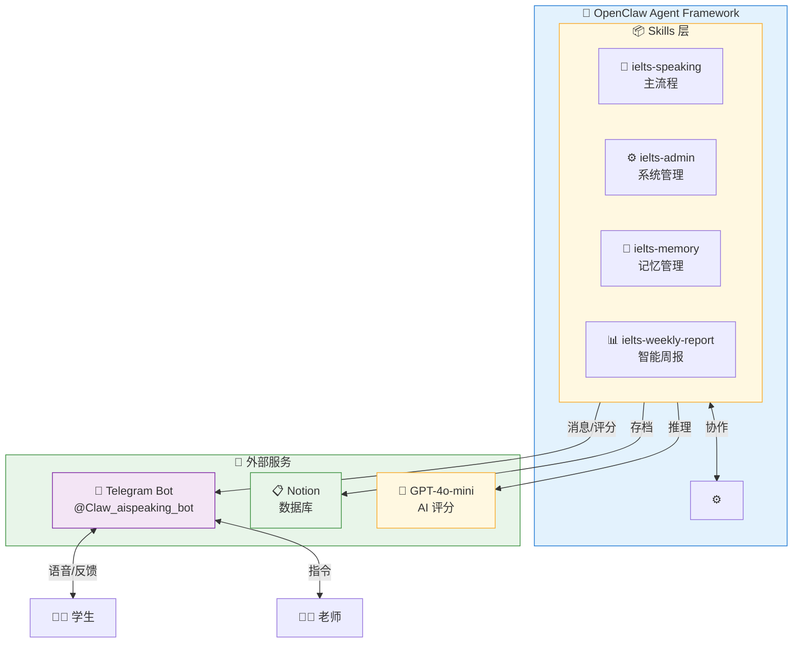
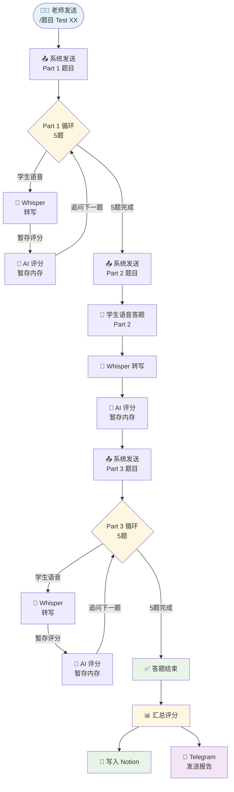
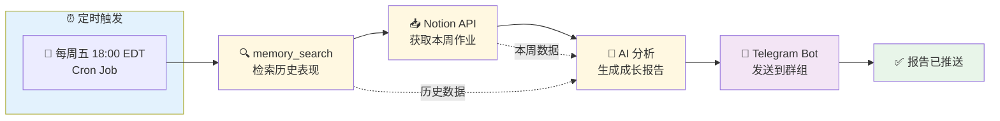
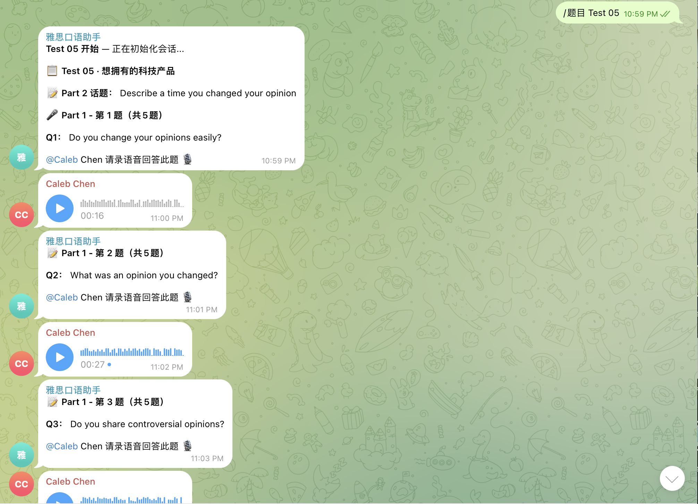
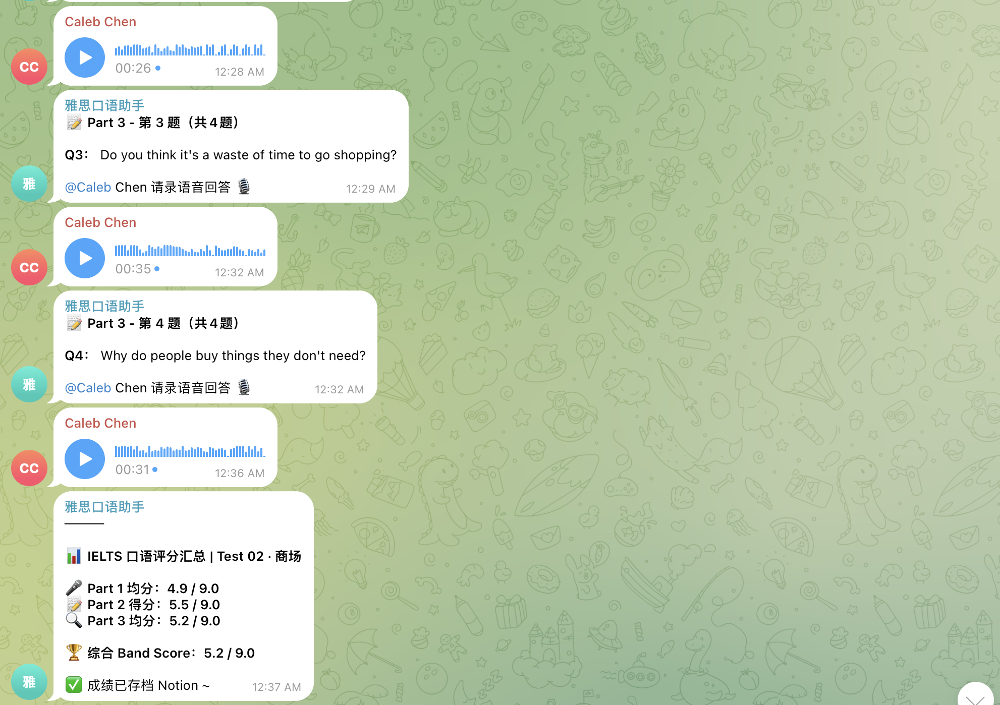
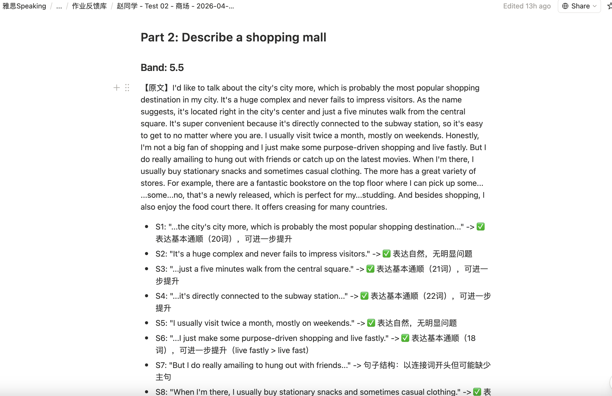
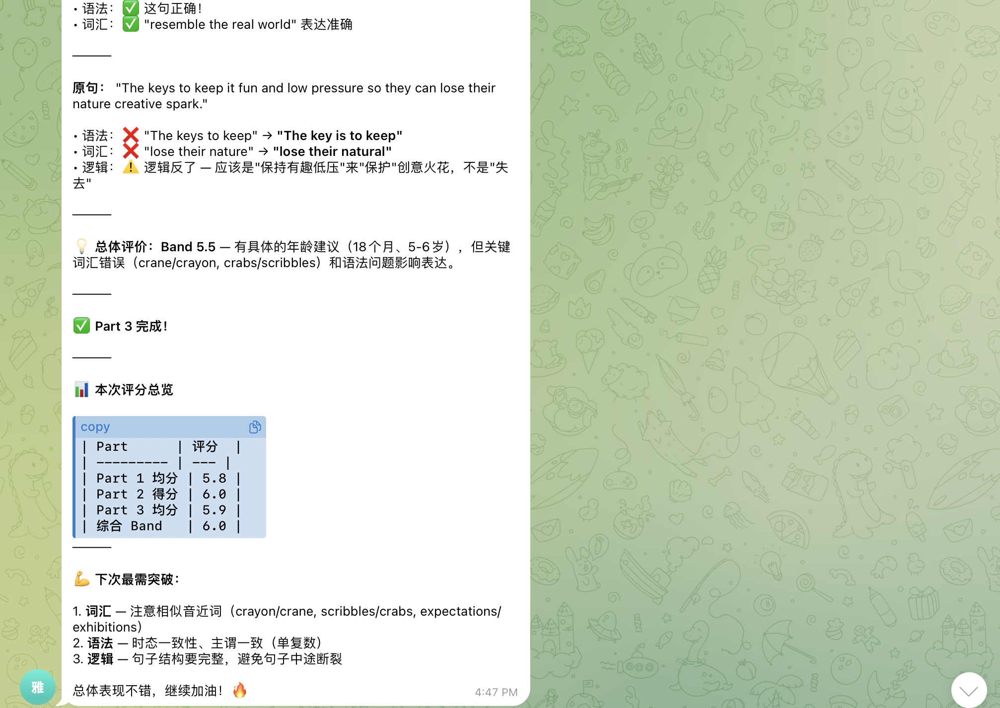
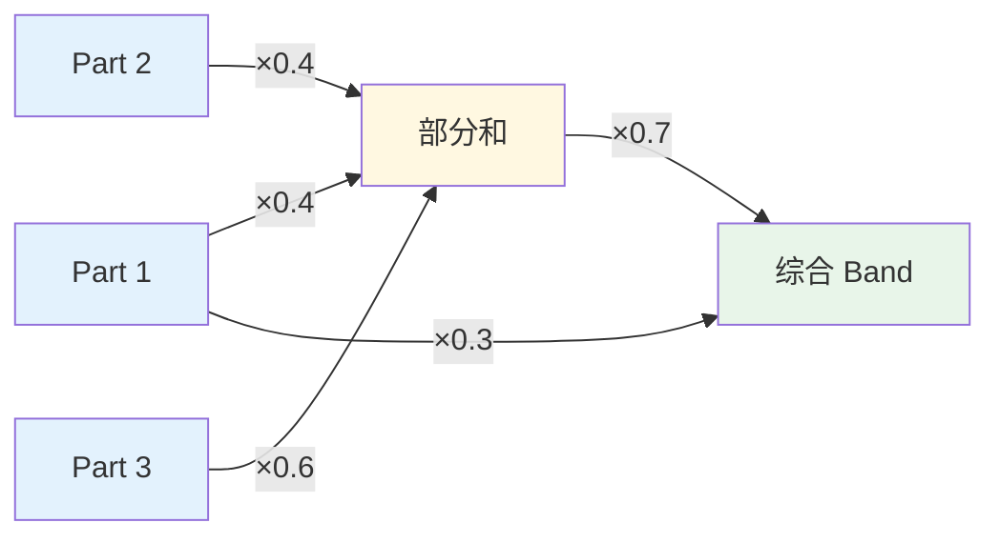

# 🎓 ielts-speaking-ai

<div align="center">

[](https://github.com/KaichenCurry/ielts-speaking-ai/stargazers)
[](LICENSE)
[](https://www.python.org/)
[](https://github.com/openclaw/openclaw)

**雅思口语 AI 助教系统 — 帮老师自动评分，让学生即时收到反馈**

[English](./README_en.md) · [项目文档](./docs/SYSTEM_DESIGN.md)

</div>

---

## 🎯 是什么

面向**雅思口语教师**的 AI 助教系统。基于 OpenClaw Agent Framework 构建，支持多 Skill 协作。

老师发一条指令 → 学生在家语音答题 → AI 自动评分 + 逐句反馈 → 结果自动存档 Notion → 智能周报推送。

---

## 🏗️ 系统架构



---

## 🔄 工作流程

### 答题流程（ielts-speaking）



**⚠️ 重要规则**：答题过程中不显示任何反馈，全部答完才输出评分！

---

### 智能周报流程（ielts-weekly-report）



---

## ✨ 核心功能

### 📝 一键布置作业

老师发送 `/题目 Test 07`，系统自动发送 Part 1/2/3 全部题目。

### 🤖 AI 自动评分（GPT-4o-mini）

| 环节 | 技术 | 说明 |
|------|------|------|
| 语音转文字 | Whisper API | OpenAI 开源，口语场景最准 |
| AI 评分 | GPT-4o-mini | 5 维度逐句分析 |
| 历史增强 | memory_search | 结合历史表现给出成长建议 |

### 📊 5 维度逐句反馈

| 维度 | 关注点 | 示例 |
|------|--------|------|
| 语法 | 主谓一致、从句 | "He go" → "He goes" |
| 词汇 | Chinglish、高分词 | "很贵" → "expensive" |
| 时态 | 过去/现在/完成时 | 过去经历用现在时 |
| 逻辑 | 因果、转折 | 观点与举例不匹配 |
| 思路 | 举例、深度 | 举例泛泛而谈 |

### 💾 Notion 自动存档

- 作业反馈库（完整答题记录）
- 错题本（错误类型 + 纠正）
- 题库（66套模考题）

📎 [题库](https://www.notion.so/bba82871-4fe1-4409-9f70-72f6bf27e7b3) · 📎 [作业库](https://www.notion.so/3412e55d-7136-8179-9ac8-ee60a420ac21) · 📎 [错题本](https://www.notion.so/3412e55d-7136-8113-aa98-cfd36af9799c)

### 📈 智能周报（成长导向）

**特点**：不是数据汇报，而是学生成长故事的讲述

```
📈 成长曲线
• 历史趋势：5.0 → 5.5 → 6.0 📈
• 本周 Band：6.0
• 进步点：Part 3 逻辑性明显提升

🏆 本周亮点
✅ 词汇多样性提升：从"very good"到"extremely beneficial"
✅ 语法错误减少：上周3处 → 本周1处

💡 下周建议
1. 时态专项：重点练过去时态描述
2. Part 3 思路：学习"一方面...另一方面"结构
```

---

## 📖 真实案例

### 截图 1：Telegram 答题界面



老师发送 `/题目 Test 05`，学生开始 Part 1 答题，系统实时记录语音回答。

---

### 截图 2：Telegram 评分报告



学生完成 Part 3 后，AI 生成评分汇总：**Band 5.2**，成绩已存档 Notion。

---

### 截图 3：Notion 逐句反馈



Notion 存档包含：题目、原文、逐句分析（Band 5.5）。

---

### 截图 4：详细评分总览



完整报告包含：
- 逐句语法/词汇/逻辑纠错
- Part 1/2/3 分项成绩
- **综合 Band 6.0**
- 下次突破点建议

---

## 📐 Band 计算公式



**公式**：
```
Part2_3合成 = Part2×0.4 + Part3×0.6
Overall = Part1×0.3 + Part2_3合成×0.7
即：Part1×30% + Part2×28% + Part3×42%
```

---

## 📁 项目结构

```
ielts-speaking-ai/
├── README.md                     # 本文件
├── README_en.md                # English version
├── LICENSE                     # MIT
├── requirements.txt            # Python 依赖
├── .env.example               # 环境变量模板
│
├── assets/                    # 截图资源
│   ├── telegram-part1-practice.png
│   ├── telegram-part3-band-report.png
│   ├── notion-part2-feedback.png
│   └── detailed-band-overview.png
│
├── scripts/                   # 核心脚本
│   ├── ielts_flow.py          # 主流程控制器
│   ├── answer_flow.py         # 状态机（Part1→2→3）
│   ├── analyze_transcript.py  # AI 评分（GPT-4o-mini）
│   ├── rag_retrieve.py        # RAG 检索
│   ├── notion_append_homework.py
│   ├── notion_append_badcase.py
│   ├── notion_search.py
│   └── weekly_report_dispatch.py
│
├── docs/                      # 文档
│   └── SYSTEM_DESIGN.md
│
└── references/                # 参考资料
    └── prompts.md             # AI 评分 Prompt
```

---

## 🛠️ 技术栈

| 环节 | 技术 | 说明 |
|------|------|------|
| Agent 框架 | OpenClaw | 多 Skill 协作系统 |
| 消息入口 | Telegram Bot | 支持语音识别 |
| AI 推理 | GPT-4o-mini / MiniMax | 逐句评分 |
| 语音转文字 | Whisper API | 口语场景 SOTA |
| 数据存储 | Notion | 老师直接使用 |

---

## ⏰ 定时任务

| 任务 | 调度 | 说明 |
|------|------|------|
| 智能周报 | 每周五 18:00 EDT | 生成并发送到 Telegram 群组 |

---

## 📊 效果数据

| 指标 | 目标 | 实际 |
|------|------|------|
| 老师效率提升 | 80%+ | ✅ |
| Band 评分误差 | ≤0.3 | **0.2** |
| 格式正确率 | ≥98% | **98%+** |

---

## 🔗 相关链接

| 资源 | 地址 |
|------|------|
| GitHub | https://github.com/KaichenCurry/ielts-speaking-ai |
| 题库 | https://www.notion.so/bba82871-4fe1-4409-9f70-72f6bf27e7b3 |
| 作业库 | https://www.notion.so/3412e55d-7136-8179-9ac8-ee60a420ac21 |
| 错题本 | https://www.notion.so/3412e55d-7136-8113-aa98-cfd36af9799c |

---

<div align="center">

**给个 ⭐ 支持一下！**

*Made by [Curry Chen](https://github.com/KaichenCurry)*

</div>
