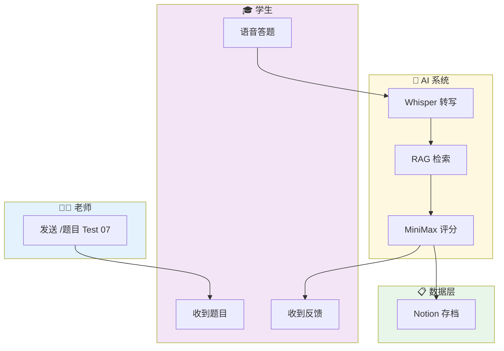

# 🎓 ielts-speaking-ai

<div align="center">

[](https://github.com/KaichenCurry/ielts-speaking-ai/stargazers)
[](LICENSE)
[](https://www.python.org/)
[](https://github.com/KaichenCurry/ielts-speaking-ai/commits)

**雅思口语 AI 助教系统 — 帮老师自动评分，让学生即时收到反馈**

[English](./README_en.md) · [项目文档](./docs/SYSTEM_DESIGN.md) · [简历内容](./docs/PORTFOLIO_RESUME.md)

</div>

---

## 🎯 是什么

面向**雅思口语教师**的 AI 助教系统。

老师发一条指令 → 学生在家语音答题 → AI 自动评分 + 逐句反馈 → 结果自动存档 Notion → 周五推送班级周报。

**一句话：把老师从重复性评分工作中解放出来。**

---

## ⚡ 快速开始

```bash
# 1. 克隆项目
git clone https://github.com/KaichenCurry/ielts-speaking-ai.git
cd ielts-speaking-ai

# 2. 安装依赖
pip install -r requirements.txt

# 3. 配置环境变量
cp .env.example .env
# 编辑 .env，填入 Token

# 4. 运行
python3 scripts/ielts_flow.py init '{"test_number": 7}'
python3 scripts/ielts_flow.py process /path/to/audio.wav
```

---

## 🔄 工作流程



---

## ✨ 核心功能

### 📝 一键布置作业

老师发送一条指令，系统自动发送 Part 1/2/3 全部题目：

```
/题目 Test 07

✅ Part 1 已发送（5题）
✅ Part 2 已发送（Cue Card）
✅ Part 3 已发送（5题）
```

### 🤖 AI 自动评分

| 环节 | 技术 | 说明 |
|------|------|------|
| 语音转文字 | Whisper | OpenAI 开源，口语场景最准 |
| 上下文增强 | RAG | 检索历史错题，让评分更有针对性 |
| AI 评分 | MiniMax | 5 维度逐句反馈 |

### 📊 5 维度逐句反馈

| 维度 | 关注点 | 示例 |
|------|--------|------|
| 语法 | 主谓一致、从句 | "He go" → "He goes" |
| 词汇 | Chinglish、高分词 | "很贵" → "expensive" |
| 时态 | 过去/现在/完成时 | 过去经历用现在时 |
| 逻辑 | 因果、转折 | 观点与举例不匹配 |
| 思路 | 举例、深度 | 举例泛泛而谈 |

### 💾 Notion 自动存档

每个学生的练习记录永久留存：
- 答题原文
- Band Score
- 逐句反馈
- 老师纠正记录

📎 [题库](https://www.notion.so/bba82871-4fe1-4409-9f70-72f6bf27e7b3) · 📎 [作业库](https://www.notion.so/3412e55d-7136-8179-9ac8-ee60a420ac21) · 📎 [错题本](https://www.notion.so/3412e55d-7136-8113-aa98-cfd36af9799c)

### 📈 周报自动推送

每周五 18:00 自动推送到 Telegram 群，包含：
- 练习人次、平均 Band
- Band 分布
- 常见错误 TOP5
- 下周教学建议

---

## 📖 真实案例

### 截图 1：Telegram 答题界面


老师发送 `/题目 Test 05`，学生开始 Part 1 答题，系统实时记录语音回答。

---

### 截图 2：Telegram 评分报告


学生完成 Part 3 后，AI 生成评分汇总：**Band 5.2**，成绩已存档 Notion。

---

### 截图 3：Notion 逐句反馈


Notion 存档包含：题目、原文、逐句分析（Band 5.5）。

---

### 截图 4：详细评分总览


完整报告包含：
- 逐句语法/词汇/逻辑纠错
- Part 1/2/3 分项成绩
- **综合 Band 6.0**
- 下次突破点建议

---

## 🛠️ 技术栈

| 环节 | 技术 | 为什么选它 |
|------|------|---------|
| 消息入口 | Telegram | 原生支持语音，跨平台，学生无门槛 |
| AI 推理 | MiniMax（OpenClaw） | 中文理解强，成本低 |
| 语音转文字 | Whisper | 口语场景 SOTA，开源可本地运行 |
| 数据存储 | Notion | 老师直接用，无需自建后台 |

**Band 公式**：
```
综合 Band = Part1×30% + (Part2×40% + Part3×60%)×70%
```

---

## 📁 项目结构

```
ielts-speaking-ai/
├── README.md                     # 本文件
├── README_en.md                 # English version
├── LICENSE                      # MIT
├── requirements.txt             # Python 依赖
├── .env.example                # 环境变量模板
│
├── assets/                     # 截图资源
│   ├── telegram-part1-practice.png
│   ├── telegram-part3-band-report.png
│   ├── notion-part2-feedback.png
│   └── detailed-band-overview.png
│
├── scripts/                     # 核心代码
│   ├── ielts_flow.py          # 主控制器
│   ├── answer_flow.py          # 状态机（Part1→2→3）
│   ├── analyze_transcript.py  # AI 评分
│   ├── rag_retrieve.py        # RAG 检索
│   ├── notion_append_homework.py
│   ├── notion_append_badcase.py
│   ├── notion_search.py
│   └── weekly_report.py
│
├── docs/                       # 文档
│   ├── SYSTEM_DESIGN.md       # 详细技术文档
│   ├── PORTFOLIO_RESUME.md    # 简历内容
│   └── INTERVIEW_PREP.md      # 面试准备
│
└── references/                # 参考资料
    ├── prompts.md
    └── prompt_changelog.md
```

---

## 🗺️ 未来路线图

### 按时间线

```
v1.0 (现在) ─────────────────────────────────────────────────────
    ✅ Telegram Bot
    ✅ Whisper 语音转写
    ✅ MiniMax AI 评分
    ✅ Notion 存档
    ✅ 周报推送

        ▼
v1.1 (2026 Q2) ────────────────────────────────────────────────
    📱 微信小程序接入
    📱 飞书 Bot 接入
    📱 企业微信接入

        ▼
v1.2 (2026 Q3) ────────────────────────────────────────────────
    🤖 Hermes Agent（下一代 AI Agent）
    🔄 多模型编排
    📚 向量检索升级 RAG

        ▼
v2.0 (2026 Q4) ────────────────────────────────────────────────
    🔧 模型微调
    👥 学生进度面板
    📄 飞书文档集成
    📄 腾讯文档集成
```

### 按模块

| 模块 | v1.0 | v1.1 | v1.2 | v2.0 |
|------|------|------|------|------|
| **平台接入** | Telegram | 微信/飞书/企微 | — | — |
| **AI 能力** | 关键词 RAG + MiniMax | — | 向量 RAG + 多模型编排 | 微调模型 |
| **数据体系** | Notion 存档 | — | 错题本 + 数据飞轮 | 学生成长面板 |
| **用户场景** | 单老师 | 班级管理 | 多班级 | 机构版 |

---

## 📊 效果数据

| 指标 | 目标 | 实际 |
|------|------|------|
| 老师效率提升 | 80%+ | ✅ |
| Band 评分误差 | ≤0.3 | **0.2** |
| 格式正确率 | ≥98% | **98%+** |

> 基于 2026-04 运营数据（20+ 次练习）

---

## 🔗 链接

| 资源 | 地址 |
|------|------|
| GitHub | https://github.com/KaichenCurry/ielts-speaking-ai |
| 题库 | https://www.notion.so/bba82871-4fe1-4409-9f70-72f6bf27e7b3 |
| 作业库 | https://www.notion.so/3412e55d-7136-8179-9ac8-ee60a420ac21 |
| 错题本 | https://www.notion.so/3412e55d-7136-8113-aa98-cfd36af9799c |

---

<div align="center">

**给个 ⭐ 支持一下！**

*Made by [Curry Chen](https://github.com/KaichenCurry)*

</div>
