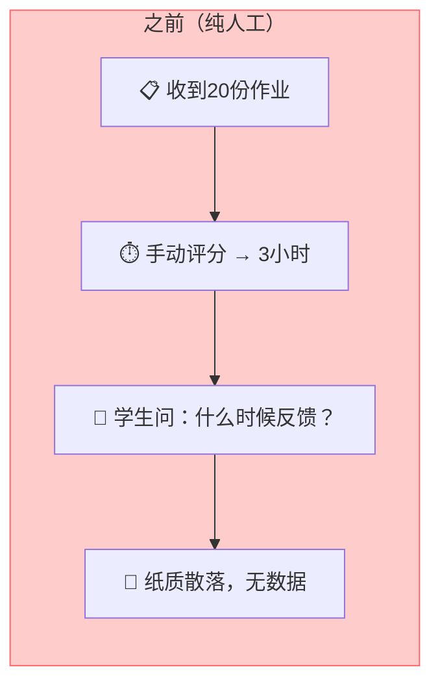
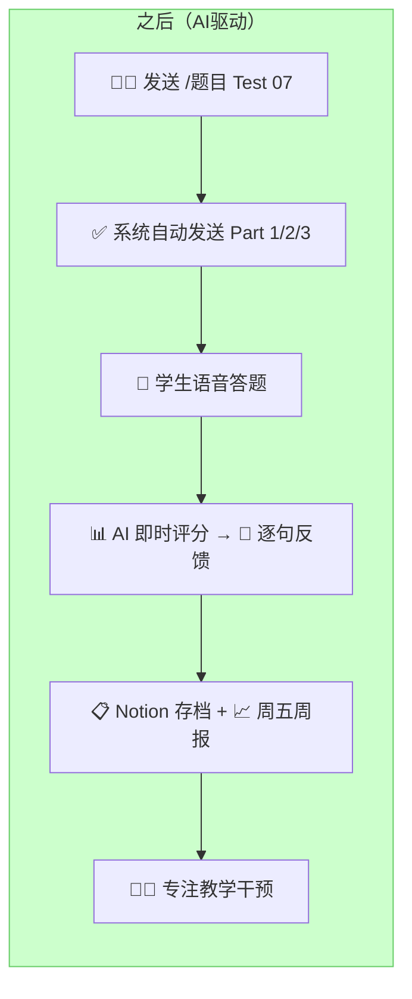
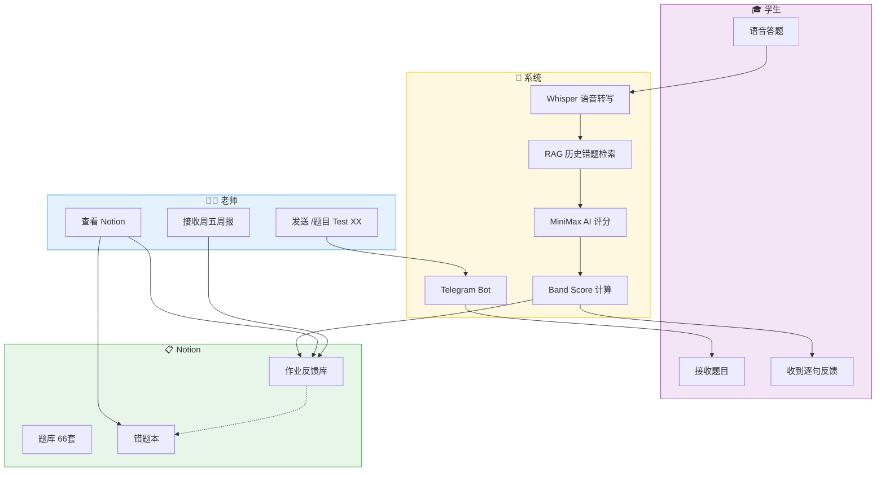
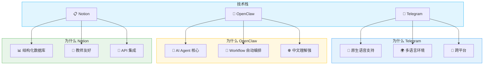
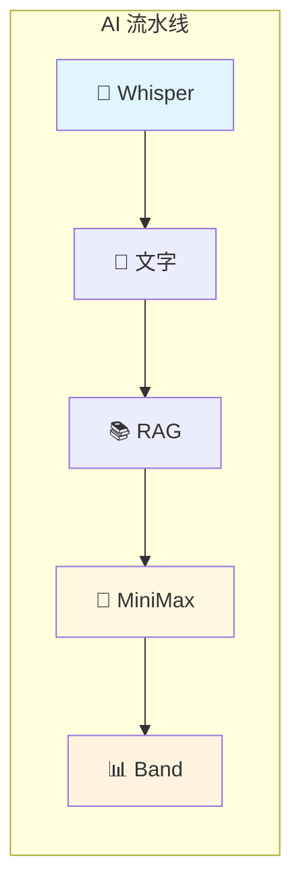
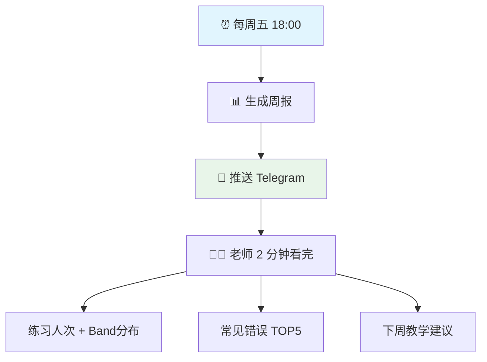
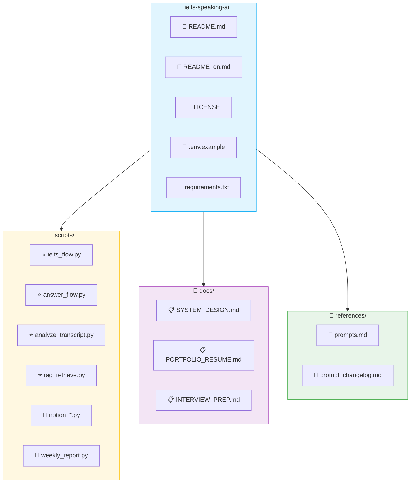
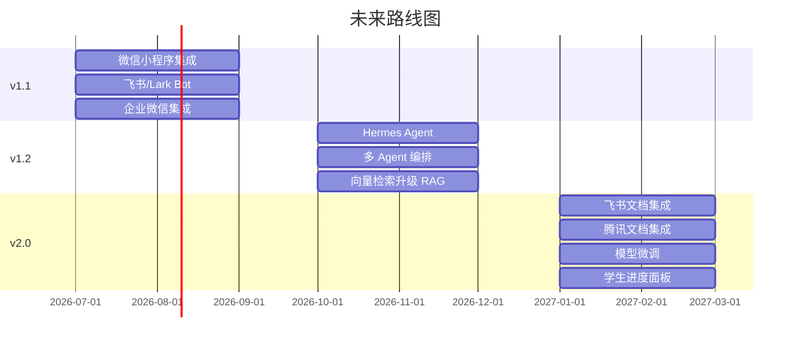
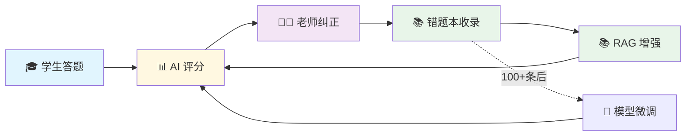

# 🎓 ielts-speaking-ai
# 雅思口语 AI 助教系统

> 让老师专注于教学，从重复性评分工作中解放。

[](https://github.com/KaichenCurry/ielts-speaking-ai/stargazers)
[](LICENSE)
[](https://www.python.org/)
[](https://github.com/KaichenCurry/ielts-speaking-ai/commits)

🌐 **语言**: 🇨🇳 **中文** | [🇺🇸 English](README_en.md)

---

## 📋 目录

- [🎯 项目介绍](#-项目介绍)
- [😤 痛点问题](#-痛点问题)
- [💡 解决方案](#-解决方案)
- [🏗️ 技术架构](#️-技术架构)
- [✨ 核心功能](#-核心功能)
- [📖 真实 Demo](#-真实-demo)
- [📁 项目结构](#-项目结构)
- [🗺️ 未来路线图](#️-未来路线图)
- [🚀 快速开始](#-快速开始)

---

## 🎯 项目介绍

### 一句话

面向**雅思口语教师**的 AI 助教系统，老师一条指令布置作业，学生在家语音答题，系统自动完成评分、逐句反馈、Notion 存档、周报推送。

### 解决什么问题

| 用户 | 痛点 | 解决方案 |
|------|------|---------|
| 老师 | 重复性评分工作繁重 | AI 自动评分，减少 80%+ 工作量 |
| 老师 | 反馈严重滞后 | 即时逐句反馈，答题结束即收到 |
| 老师 | 学生数据散落 | Notion 存档，随时可查 |
| 老师 | 班级进度黑盒 | 周五自动推送班级全景周报 |

---

## 😤 痛点问题

### 之前 vs 之后





---

## 💡 解决方案

### 完整工作流



---

## 🏗️ 技术架构

### 为什么选这三个平台？



### AI 流水线


---

## ✨ 核心功能

### 1️⃣ 一键布置作业

```
命令：/题目 Test 07

✅ Part 1 已发送（5题）
✅ Part 2 已发送（Cue Card）
✅ Part 3 已发送（5题）
```

### 2️⃣ AI 自动评测



| 环节 | 技术 | 作用 |
|------|------|------|
| 🎤 语音识别 | Whisper | 语音 → 文字 |
| 📚 上下文增强 | RAG | 历史错题检索 |
| 🧠 评分推理 | MiniMax | 5 维度评分 |
| 📊 Band 计算 | 公式 | Part1×30% + (Part2×40%+Part3×60%)×70% |

### 3️⃣ 逐句多维度反馈

| 维度 | 关注点 | 示例 |
|------|--------|------|
| 📝 语法 | 主谓一致、从句 | "He go" → "He goes" |
| 📖 词汇 | Chinglish、高分词 | "很贵" → "expensive" |
| ⏰ 时态 | 过去/现在/完成时 | 过去经历用现在时 |
| 🔗 逻辑 | 因果、转折 | 观点与举例不匹配 |
| 💡 思路 | 举例、深度 | 举例泛泛而谈 |

### 4️⃣ Notion 数据存档

📎 [题库](https://www.notion.so/bba82871-4fe1-4409-9f70-72f6bf27e7b3) | 📎 [作业反馈库](https://www.notion.so/3412e55d-7136-8179-9ac8-ee60a420ac21) | 📎 [错题本](https://www.notion.so/3412e55d-7136-8113-aa98-cfd36af9799c)

### 5️⃣ 周报自动推送



---

## 📖 真实 Demo

### 学生答题 → AI 反馈

**原音转写**：
> "Definitely, yes, reading has been my hobby since I was a child and I've been a catering story books for fun, but now I'm preparing for my studies abroad and shifted to reading academic articles..."

**AI 逐句反馈**：

| 原句 | 语法 | 词汇 | 时态 | 逻辑 | 思路 |
|------|------|------|------|------|------|
| "reading has been my hobby since I was a child" | ✅ | ✅ | ✅ | ✅ | ✅ |
| "I've been a catering story books" | ✅ | ❌ `catering` → `reading` | ✅ | ✅ | ✅ |
| "shifted to reading academic articles" | ✅ | ✅ | ✅ | ✅ | ✅ |
| "It's a total problem of horizons" | ✅ | ❌ Chinglish → `broadened my horizons` | ✅ | ✅ | ✅ |

**结果**：Band Score **6.0 / 9.0**

---

## 📁 项目结构



---

## 🗺️ 未来路线图

### 技术演进


### 版本功能



---

## 🚀 快速开始

### 1. 克隆项目
```bash
git clone https://github.com/KaichenCurry/ielts-speaking-ai.git
cd ielts-speaking-ai
```

### 2. 安装依赖
```bash
pip install -r requirements.txt
```

### 3. 配置环境
```bash
cp .env.example .env
# 编辑 .env 填写 Token
```

### 4. 运行
```bash
python3 scripts/ielts_flow.py init '{"test_number": 7}'
python3 scripts/ielts_flow.py process /path/to/audio.wav
```

---

## 📊 效果指标

> ⚠️ **可信度说明**：基于 2026-04 运营数据（20+ 次练习），仅供参考。

| 指标 | 目标 | 实际 |
|------|------|------|
| Band 评分误差 | ≤0.3 | **0.2** |
| 格式正确率 | ≥98% | **98%+** |

---

## 🔄 数据飞轮



---

## 👤 作者

**Curry Chen** | [GitHub](https://github.com/KaichenCurry) | [项目链接](https://github.com/KaichenCurry/ielts-speaking-ai)

---

## 📜 License

[MIT License](LICENSE)

---

<p align="center">
  <strong>⭐ Star this project if you find it helpful!</strong>
</p>
