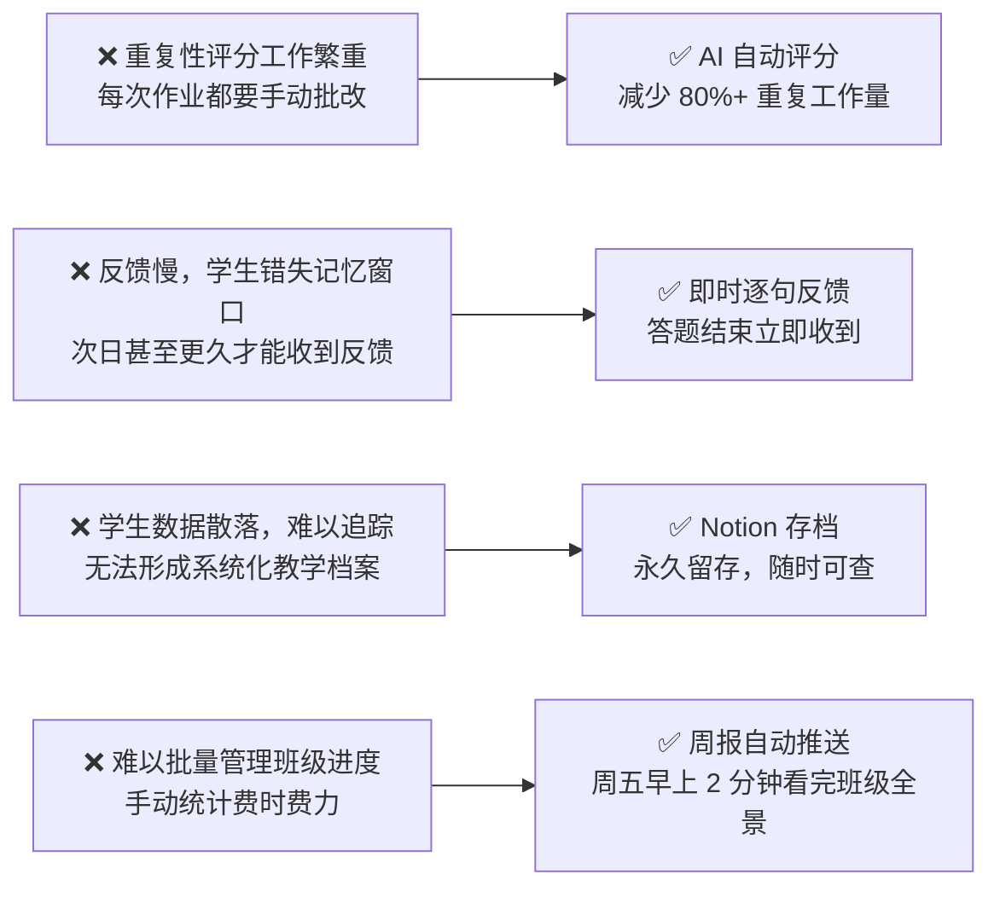
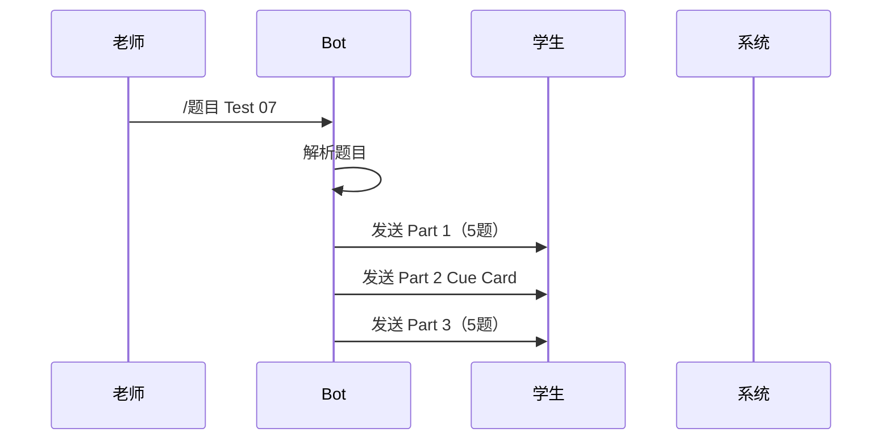
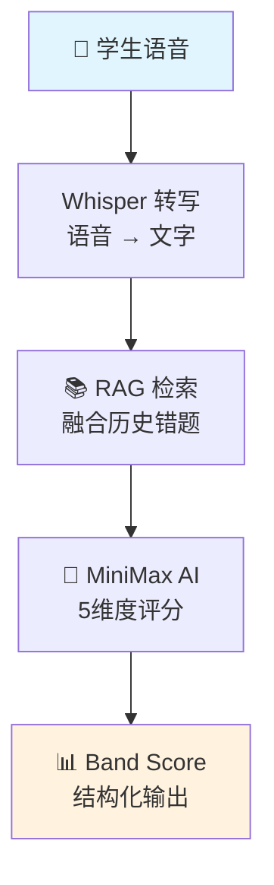
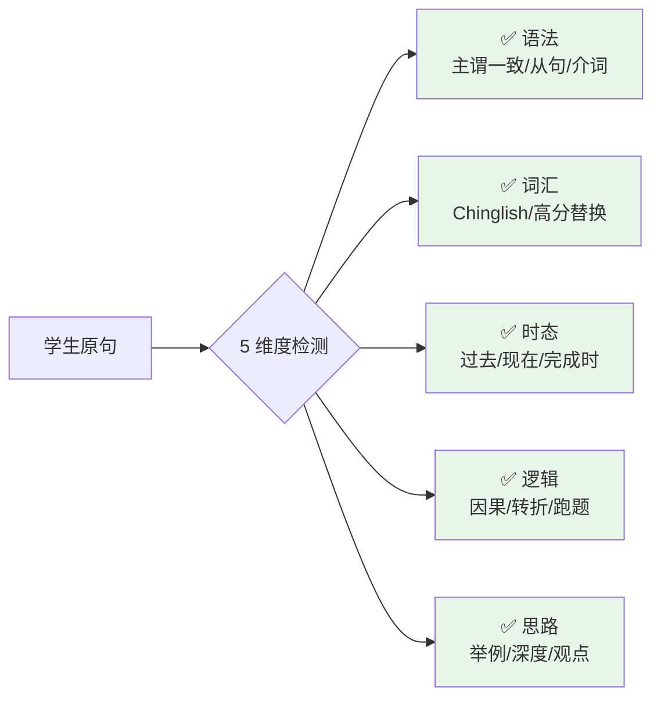
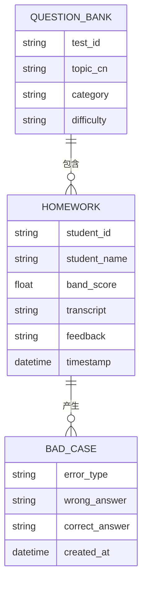
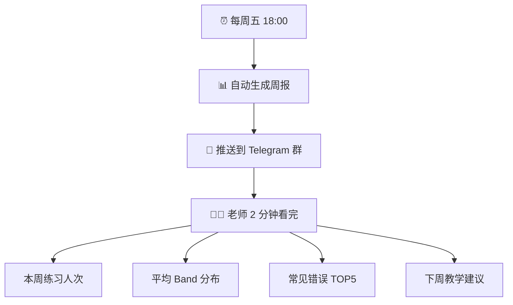
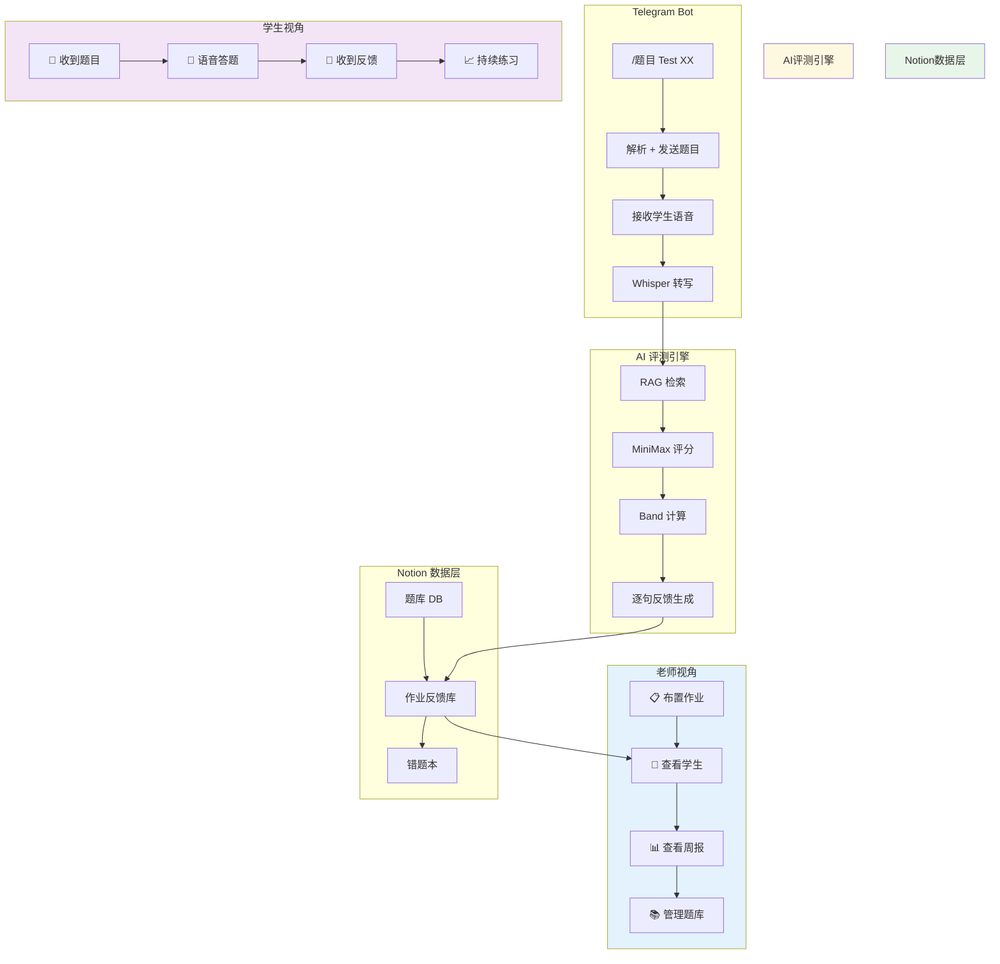
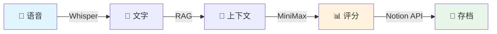
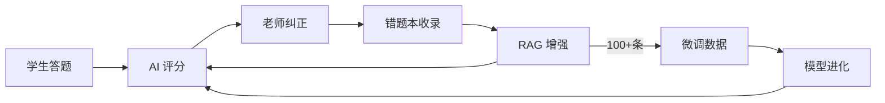

# ielts-speaking-ai
# 雅思口语 AI 助教系统

> 面向雅思口语教师的 AI 辅助教学工具 —— 课后作业布置、AI 自动评测、逐句反馈、数据存档、周报分析，让老师专注于真正的教学干预。

🇨🇳 [中文介绍](#中文介绍) | 🇬🇧 [English](#english)

---

## 🎯 一句话介绍

**雅思口语教师的 AI 助教**：老师一条指令布置作业，学生在家语音答题，系统自动完成评分、逐句反馈、Notion 存档、周报推送，全部无需老师介入。

---

## 👨‍🏫 目标用户

| 用户 | 使用场景 |
|------|---------|
| **雅思口语教师** | 布置作业、查看学生表现、掌握班级进度 |
| **雅思备考学生** | 接收作业、语音答题、收到逐句反馈 |

---

## 💡 核心价值

### 老师的四大痛点，我们一一解决



---

## 🚀 五大核心功能

### 功能 1️⃣：一键布置作业



> 老师只需一条指令，66 套真题题库随时调用，Part 1/2/3 全部题目自动发给学生。

---

### 功能 2️⃣：AI 自动评测



| AI 环节 | 技术选型 | 作用 |
|---------|---------|------|
| 语音识别 | Whisper | 学生语音 → 文字，无时间限制 |
| 上下文增强 | RAG | 融合 Notion 历史错题，提升准确性 |
| 评分推理 | MiniMax | 5 维度精细化评分 |

---

### 功能 3️⃣：逐句多维度反馈



**Band Score 计算**：
```
综合 Band = Part1×30% + (Part2×40% + Part3×60%)×70%
```

---

### 功能 4️⃣：Notion 数据存档



| 数据库 | 用途 | 数据量 |
|--------|------|--------|
| **题库** | 66 套真题存档 | Test 1-66 |
| **作业反馈库** | 学生每次练习存档 | 永久留存 |
| **错题本** | 错误案例积累 | 持续增加 |

📎 **Notion 链接**（需登录 Notion）：
- [题库](https://www.notion.so/bba82871-4fe1-4409-9f70-72f6bf27e7b3)
- [作业反馈库](https://www.notion.so/3412e55d-7136-8179-9ac8-ee60a420ac21)
- [错题本](https://www.notion.so/3412e55d-7136-8113-aa98-cfd36af9799c)

---

### 功能 5️⃣：班级周报推送



---

## 🔧 完整系统架构



---

## 👨‍🏫 老师操作指南

### 5.1 布置作业

```
命令：/题目 Test 07

示例：
/题目 Test 07

Bot 返回：
✅ Part 1 已发送（5题）
✅ Part 2 已发送（Cue Card）
✅ Part 3 已发送（5题）

学生已收到题目，等待答题中...
```

### 5.2 纠正学生错误

```
命令：/纠正 [正确表达]

示例：
/纠正 "temporal winds" 应改为 "typhoon winds"

Bot 返回：
✅ 已收录到错题本
📝 错误类型：词汇
💬 学生原句：temporal winds
✅ 老师纠正：typhoon winds
```

### 5.3 查看学生作业

打开 Notion → 选择「作业反馈库」→ 按学生/时间筛选

### 5.4 查看周报

每周五 18:00 自动推送到 Telegram 群，无需任何操作

---

## 📊 效果指标

| 指标 | 目标 | 实际 |
|------|------|------|
| Band 评分误差 | ≤0.3 | **0.2** ✅ |
| 格式正确率 | ≥98% | **98%+** ✅ |
| 老师效率提升 | — | **80%+** ✅ |
| 题库规模 | — | **66 套** ✅ |
| 周报自动推送 | 每周五 18:00 | ✅ 已运行 |

---

## 📂 项目结构

```
ielts-speaking-ai/
├── README.md                    # 项目介绍（本文件）
├── SKILL.md                     # 完整系统设计文档
│
├── docs/
│   ├── SYSTEM_DESIGN.md        # 详细技术文档
│   └── PORTFOLIO_RESUME.md     # 简历 & 作品集
│
├── scripts/                    # ═══════════════════
│                                 #   核心业务脚本
│   ├── ielts_flow.py          # ⭐ 主流程控制器
│   ├── answer_flow.py         # ⭐ 状态机实现
│   ├── analyze_transcript.py  # ⭐ AI 评分分析
│   ├── rag_retrieve.py        # ⭐ RAG 检索增强
│   │
│   ├── notion_search.py        # Notion 题库搜索
│   ├── notion_append_homework.py # 作业写入
│   ├── notion_append_badcase.py  # 错题本写入
│   │
│   ├── topic_updater.py        # 题库每周自动更新
│   ├── update_unique.py       # 66套独特话题生成
│   │
│   ├── weekly_report.py        # 周报生成
│   ├── weekly_report_dispatch.py # 周报自动推送
│   ├── evaluate_weekly.py     # 每周效果评估
│   │
│   ├── create_homework_db.py  # 作业库初始化
│   ├── setup_badcase_db.py    # 错题本初始化
│   │
│   └── transcribe.py          # Whisper 转写
│
└── references/
    ├── prompts.md              # 评分 Prompt 模板
    └── prompt_changelog.md     # Prompt 迭代日志
```

---

## 🧠 AI 能力设计

### 多模型协同架构



### 为什么选择轻量级 RAG？

| 方案 | 适合场景 | 本系统 |
|------|---------|--------|
| Pinecone/Chroma | 大量非结构化文档 | 数据量 < 1000 条 |
| **关键词检索** | 结构化数据 + 固定字段 | ✅ Notion 数据已结构化 |

**结论**：够用就好，不过度设计

---

## 🔄 数据飞轮



---

## 🚀 快速部署

### 环境要求
- Python 3.8+
- Telegram Bot Token
- MiniMax API Key
- Notion Integration Token
- OpenAI Whisper

### 配置

```bash
# 克隆项目
git clone https://github.com/KaichenCurry/ielts-speaking-ai.git
cd ielts-speaking-ai

# 安装依赖
pip install openai notion-client python-telegram-bot whisper

# 配置环境变量
export TELEGRAM_BOT_TOKEN="your_token"
export MINIMAX_API_KEY="your_key"
export NOTION_TOKEN="your_notion_token"
```

### 运行

```bash
python scripts/ielts_flow.py
```

---

## 📝 License

MIT License

---

## 👤 作者

**Curry Chen**  
雅思口语教师 / AI 产品探索者

- GitHub: [@KaichenCurry](https://github.com/KaichenCurry)
- 项目链接: https://github.com/KaichenCurry/ielts-speaking-ai

---

## 🇨🇳 中文介绍

### 雅思口语 AI 助教系统

面向雅思口语教师的 AI 辅助教学工具，帮助老师：

- **一键布置作业**：66 套真题，随时调用
- **AI 自动评测**：Whisper + MiniMax + RAG，逐句多维度反馈
- **Notion 存档**：学生数据永久留存，支持追踪分析
- **周报推送**：每周五自动推送班级全景报告
- **题库更新**：每周三、六定时自动更新

### 技术亮点

- 多模型协同（Whisper + MiniMax + RAG）
- 三段式状态机（Part 1→Part 2→Part 3）
- Band 评分误差 ≤0.3
- 数据飞轮设计，持续自我进化

---

<p align="center">
  <strong>如果你觉得这个项目有帮助，欢迎点个 ⭐ Star！</strong>
</p>
