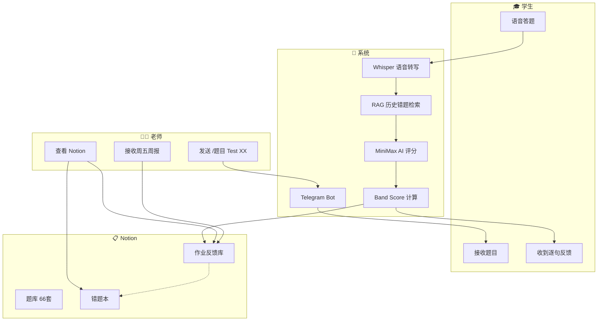
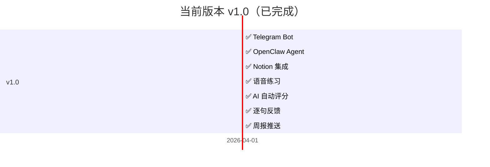

# 🎓 ielts-speaking-ai
# 雅思口语 AI 助教系统

> 让老师专注于教学，从重复性评分工作中解放。

[](https://github.com/KaichenCurry/ielts-speaking-ai/stargazers)
[](LICENSE)
[](https://www.python.org/)
[](https://github.com/KaichenCurry/ielts-speaking-ai/commits)

🌐 **语言**: 🇨🇳 **中文** | [🇺🇸 English](README_en.md)

---

## 📋 目录

- [🎯 项目介绍](#-项目介绍)
- [😤 痛点问题](#-痛点问题)
- [💡 解决方案](#-解决方案)
- [🏗️ 技术架构](#️-技术架构)
- [✨ 核心功能](#-核心功能)
- [📖 真实 Demo](#-真实-demo)
- [📁 项目结构](#-项目结构)
- [🗺️ 未来路线图](#️-未来路线图)
- [🚀 快速开始](#-快速开始)

---

## 🎯 项目介绍

### 一句话

面向**雅思口语教师**的 AI 助教系统，老师一条指令布置作业，学生在家语音答题，系统自动完成评分、逐句反馈、Notion 存档、周报推送。

### 解决什么问题

| 用户 | 痛点 | 解决方案 |
|------|------|---------|
| 老师 | 重复性评分工作繁重 | AI 自动评分，减少 80%+ 工作量 |
| 老师 | 反馈严重滞后 | 即时逐句反馈，答题结束即收到 |
| 老师 | 学生数据散落 | Notion 存档，随时可查 |
| 老师 | 班级进度黑盒 | 周五自动推送班级全景周报 |

---

## 😤 痛点问题

### 之前 vs 之后

```
┌─────────────────────────────────────────────────────────────────────┐
│                        BEFORE（纯人工）                               │
├─────────────────────────────────────────────────────────────────────┤
│                                                                      │
│   📋 老师收到20份作业                                                │
│        ↓                                                             │
│   ⏱️ 手动评分 → 3小时重复性工作                                       │
│        ↓                                                             │
│   😤 学生问："什么时候能收到反馈？"                                    │
│        ↓                                                             │
│   📝 纸质散落 → 无数据 → 无追踪                                      │
│                                                                      │
└─────────────────────────────────────────────────────────────────────┘
                              ↓
                   🎯 ielts-speaking-ai ↓
                              ↓
┌─────────────────────────────────────────────────────────────────────┐
│                        AFTER（AI驱动）                                │
├─────────────────────────────────────────────────────────────────────┤
│                                                                      │
│   👨‍🏫 老师发送 → /题目 Test 07    ⌨️ 一条指令                       │
│        ↓                                                             │
│   ✅ 系统自动发送 Part 1/2/3 全部题目                                 │
│        ↓                                                             │
│   🎤 学生语音答题 → 📊 AI即时评分 → 💬 逐句反馈                     │
│        ↓                                                             │
│   📋 Notion自动存档 + 📈 周五自动推送周报                             │
│        ↓                                                             │
│   👨‍🏫 老师专注教学干预，不再做评分员                                 │
│                                                                      │
└─────────────────────────────────────────────────────────────────────┘
```

---

## 💡 解决方案

### 完整工作流



---

## 🏗️ 技术架构

### 技术栈选择理由

```
┌─────────────────────────────────────────────────────────────────────┐
│                                                                      │
│   ┌─────────────┐     ┌─────────────┐     ┌─────────────┐          │
│   │    📱       │     │    🤖       │     │    📋       │          │
│   │  Telegram   │  +  │  OpenClaw   │  +  │   Notion    │          │
│   │─────────────│     │─────────────│     │─────────────│          │
│   │ 🌐 即时通讯  │     │ 🧠 AI Agent │     │ 📊 数据存储  │          │
│   │ 🎤 原生语音  │     │ 🔄 Workflow │     │ 📝 结构化   │          │
│   │ 📱 跨平台    │     │ 🌐 中文理解  │     │ 🔗 API集成  │          │
│   └─────────────┘     └─────────────┘     └─────────────┘          │
│                                                                      │
└─────────────────────────────────────────────────────────────────────┘
```

### 为什么选 Telegram？

| 优势 | 说明 |
|------|------|
| 🎤 原生语音 | Telegram 支持语音消息，适配口语练习场景 |
| 🌍 多语言 | 内置翻译功能，国际学生也能用 |
| 📱 跨平台 | iOS/Android/Desktop，学生随时练习 |
| 🔔 即时通知 | 学生立即收到题目 |
| 📊 群组功能 | 内置周报推送 |

### 为什么选 OpenClaw？

| 优势 | 说明 |
|------|------|
| 🧠 AI Agent | 原生集成 Whisper + MiniMax + RAG |
| 🔄 Workflow | Part 1→2→3 状态机自动编排 |
| 🌐 中文理解 | 优秀的中文语境理解能力 |
| 💰 成本效益 | 相比 GPT-4，更适合教育场景 |

### 为什么选 Notion？

| 优势 | 说明 |
|------|------|
| 📊 结构化数据 | 题库、作业存档、错题本 |
| 📝 教师友好 | 无代码数据库，非技术老师也能用 |
| 🔗 API 集成 | 自动存档作业，可搜索 |
| 📈 进度追踪 | 学生成长轨迹可视化 |

### AI 流水线


---

## ✨ 核心功能

### 1️⃣ 一键布置作业
```
命令：/题目 Test 07

✅ Part 1 已发送（5题）
✅ Part 2 已发送（Cue Card）
✅ Part 3 已发送（5题）
```
66 套真题，随时调用。

### 2️⃣ AI 自动评测

| 环节 | 技术 | 作用 |
|------|------|------|
| 🎤 语音识别 | Whisper | 语音 → 文字 |
| 📚 上下文增强 | RAG | 历史错题检索 |
| 🧠 评分推理 | MiniMax | 5 维度评分 |
| 📊 Band 计算 | 公式 | Part1×30% + (Part2×40%+Part3×60%)×70% |

### 3️⃣ 逐句多维度反馈

| 维度 | 关注点 | 示例 |
|------|--------|------|
| 📝 语法 | 主谓一致、从句 | "He go" → "He goes" |
| 📖 词汇 | Chinglish、高分词 | "很贵" → "expensive" |
| ⏰ 时态 | 过去/现在/完成时 | 过去经历用现在时 |
| 🔗 逻辑 | 因果、转折 | 观点与举例不匹配 |
| 💡 思路 | 举例、深度 | 举例泛泛而谈 |

### 4️⃣ Notion 数据存档

📎 [题库](https://www.notion.so/bba82871-4fe1-4409-9f70-72f6bf27e7b3) | 📎 [作业反馈库](https://www.notion.so/3412e55d-7136-8179-9ac8-ee60a420ac21) | 📎 [错题本](https://www.notion.so/3412e55d-7136-8113-aa98-cfd36af9799c)

### 5️⃣ 周报自动推送

```
📊 周报 | 2026.04.11-04.15

【练习概览】
• 练习人次：12
• 平均 Band：6.2
• 较上周变化：+0.3 ↑

【Band 分布】
• 7.0+：3人 ████
• 6.0-6.5：6人 ████████████
• 5.5-6.0：2人 ████

【常见错误 TOP5】
1. 时态混用 —— 8次
2. 主谓不一致 —— 6次
3. 举例不匹配 —— 5次
```

---

## 📖 真实 Demo

### 学生答题 → AI 反馈

**原音转写**：
> "Definitely, yes, reading has been my hobby since I was a child and I've been a catering story books for fun, but now I'm preparing for my studies abroad and shifted to reading academic articles..."

**AI 逐句反馈**：

| 原句 | 语法 | 词汇 | 时态 | 逻辑 | 思路 |
|------|------|------|------|------|------|
| "reading has been my hobby since I was a child" | ✅ | ✅ | ✅ | ✅ | ✅ |
| "I've been a catering story books" | ✅ | ❌ `catering` → `reading` | ✅ | ✅ | ✅ |
| "shifted to reading academic articles" | ✅ | ✅ | ✅ | ✅ | ✅ |
| "It's a total problem of horizons" | ✅ | ❌ Chinglish → `broadened my horizons` | ✅ | ✅ | ✅ |

**结果**：Band Score **6.0 / 9.0**

---

## 📁 项目结构

```
┌─────────────────────────────────────────────────────────────────────┐
│                        项目结构                                      │
├─────────────────────────────────────────────────────────────────────┤
│                                                                      │
│  📄 README.md              ← 中文介绍（默认显示）                     │
│  📄 README_en.md           ← English version                         │
│  📄 LICENSE                ← MIT 开源协议                           │
│  📄 .env.example           ← 环境变量模板                           │
│  📄 requirements.txt        ← Python 依赖                            │
│                                                                      │
│  ┌─────────────────────────────────────────────────────────────┐   │
│  │  📁 scripts/                 核心脚本                          │   │
│  ├─────────────────────────────────────────────────────────────┤   │
│  │  ⭐ ielts_flow.py           主流程控制器                      │   │
│  │  ⭐ answer_flow.py           状态机（Part1→2→3）             │   │
│  │  ⭐ analyze_transcript.py   AI 评分分析                       │   │
│  │  ⭐ rag_retrieve.py         RAG 检索增强                      │   │
│  │  📱 notion_search.py         Notion 题库搜索                    │   │
│  │  📱 notion_append_*.py      Notion 存档                       │   │
│  │  🔄 topic_updater.py        题库自动更新                       │   │
│  │  🔄 weekly_report.py        周报生成                           │   │
│  └─────────────────────────────────────────────────────────────┘   │
│                                                                      │
│  ┌─────────────────────────────────────────────────────────────┐   │
│  │  📁 docs/                    文档                            │   │
│  ├─────────────────────────────────────────────────────────────┤   │
│  │  📋 SYSTEM_DESIGN.md        详细技术文档                      │   │
│  │  📋 PORTFOLIO_RESUME.md     简历 & 作品集                     │   │
│  └─────────────────────────────────────────────────────────────┘   │
│                                                                      │
│  ┌─────────────────────────────────────────────────────────────┐   │
│  │  📁 references/              参考资料                          │   │
│  ├─────────────────────────────────────────────────────────────┤   │
│  │  📝 prompts.md              评分 Prompt 模板                  │   │
│  │  📝 prompt_changelog.md     Prompt 迭代记录                  │   │
│  └─────────────────────────────────────────────────────────────┘   │
│                                                                      │
└─────────────────────────────────────────────────────────────────────┘
```

---

## 🗺️ 未来路线图

### 当前版本 ✅ v1.0



### 未来版本 🔜

| 版本 | 时间 | 功能 | 状态 |
|------|------|------|------|
| **v1.1** | 2026 Q2 | 微信小程序集成 | 🔜 |
| | | 飞书/Lark Bot 集成 | 🔜 |
| | | 企业微信集成 | 🔜 |
| **v1.2** | 2026 Q3 | Hermes Agent（下一代） | 🔜 |
| | | 多 Agent 编排 | 🔜 |
| | | 向量检索升级 RAG | 🔜 |
| **v2.0** | 2026 Q4 | 飞书文档集成 | 🔜 |
| | | 腾讯文档集成 | 🔜 |
| | | 模型微调 | 🔜 |
| | | 学生进度面板 | 🔜 |

### 技术演进

```
┌─────────────────────────────────────────────────────────────────────┐
│                      技术演进路线                                      │
├─────────────────────────────────────────────────────────────────────┤
│                                                                      │
│   v1.0 (当前)          v1.2 (Q3)           v2.0 (Q4)             │
│   ──────────            ──────────           ──────────             │
│                                                                      │
│   📱 Telegram          📱 Telegram          📱 Telegram              │
│      ↓                    ↓                   ↓                     │
│   🤖 OpenClaw          🤖 OpenClaw         🤖 Hermes                │
│   (MiniMax)            (Multi-Agent)       (Advanced)              │
│      ↓                    ↓                   ↓                     │
│   📚 关键词 RAG         📚 向量 RAG         📚 微调模型              │
│      ↓                    ↓                   ↓                     │
│   📋 Notion             📋 Notion          📋 飞书/腾讯文档          │
│                                                                      │
└─────────────────────────────────────────────────────────────────────┘
```

---

## 🚀 快速开始

### 1. 克隆项目
```bash
git clone https://github.com/KaichenCurry/ielts-speaking-ai.git
cd ielts-speaking-ai
```

### 2. 安装依赖
```bash
pip install -r requirements.txt
```

### 3. 配置环境
```bash
cp .env.example .env
# 编辑 .env 填写 Token
```

### 4. 运行
```bash
# 初始化会话
python3 scripts/ielts_flow.py init '{"test_number": 7}'

# 处理学生音频
python3 scripts/ielts_flow.py process /path/to/audio.wav
```

---

## 📊 效果指标

> ⚠️ **可信度说明**：基于 2026-04 运营数据（20+ 次练习），仅供参考。

| 指标 | 目标 | 实际 |
|------|------|------|
| Band 评分误差 | ≤0.3 | **0.2** |
| 格式正确率 | ≥98% | **98%+** |

---

## 🔄 数据飞轮

```
学生答题 → AI评分 → 老师纠正 → 错题本收录 → RAG增强 → 微调数据
```

每一次老师纠正都是高质量标注数据。当错题本积累到 100+ 条后，可启动模型微调。

---

## 👤 作者

**Curry Chen** | [GitHub](https://github.com/KaichenCurry) | [项目链接](https://github.com/KaichenCurry/ielts-speaking-ai)

---

## 📜 License

[MIT License](LICENSE)

---

<p align="center">
  <strong>⭐ Star this project if you find it helpful!</strong>
</p>
