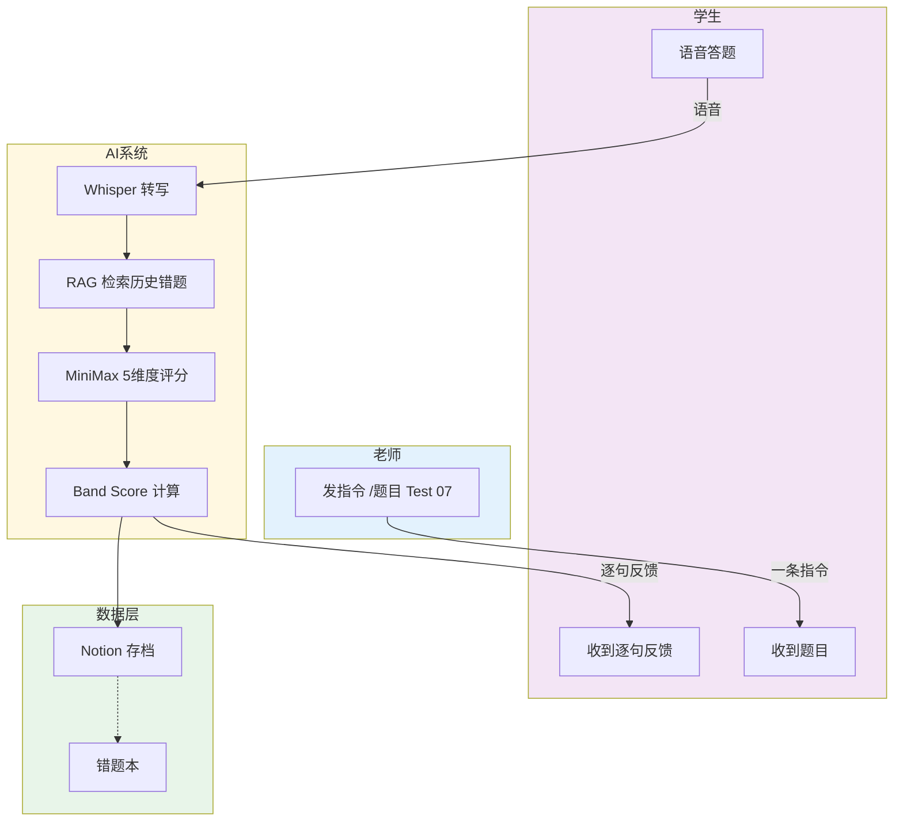

# 🎓 ielts-speaking-ai
# 雅思口语 AI 助教系统

> 帮老师自动评分，让老师专注教学。

[](https://github.com/KaichenCurry/ielts-speaking-ai/stargazers)
[](LICENSE)
[](https://www.python.org/)
[](https://github.com/KaichenCurry/ielts-speaking-ai/commits)

🌐 **语言**: 🇨🇳 **中文** | [🇺🇸 English](README_en.md)

---

## 是什么

帮**雅思口语老师**自动评分的 AI 工具。

老师发一条指令，学生在家语音答题，系统自动评分、逐句反馈、存档 Notion、推送周报。

---

## 核心流程



---

## 解决了什么问题

| 之前（老师） | 之后（AI） |
|-------------|-------------|
| 手动评分，每份 3 小时 | AI 自动评分，0 秒 |
| 学生等一天才收到反馈 | 答题结束立即收到 |
| 数据散落在微信/邮件 | 自动存档到 Notion |
| 手动统计班级进度 | 每周五自动推送周报 |

---

## 效果数据

| 指标 | 数值 |
|------|------|
| 老师效率提升 | **80%+** |
| Band 评分误差 | **0.2** |
| 格式正确率 | **98%+** |

> 基于 2026-04 运营数据（20+ 次练习）

---

## 5 大功能

### 1️⃣ 一键布置作业
老师发送 `/题目 Test 07`，系统自动发送 Part 1/2/3 全部题目，66 套真题库随时调用。

### 2️⃣ AI 自动评分
```
学生语音 → Whisper 转写 → RAG 检索历史错题 → MiniMax 评分
```
MiniMax 输出 5 维度逐句反馈：语法 / 词汇 / 时态 / 逻辑 / 思路

### 3️⃣ 即时逐句反馈

| 维度 | 关注点 | 示例 |
|------|--------|------|
| 语法 | 主谓一致、从句 | "He go" → "He goes" |
| 词汇 | Chinglish、高分词 | "很贵" → "expensive" |
| 时态 | 过去/现在/完成时 | 过去经历用现在时 |
| 逻辑 | 因果、转折 | 观点与举例不匹配 |
| 思路 | 举例、深度 | 举例泛泛而谈 |

### 4️⃣ Notion 自动存档

每个学生的练习记录永久留存：
- 答题原文
- Band Score
- 逐句反馈
- 老师纠正记录

📎 [题库](https://www.notion.so/bba82871-4fe1-4409-9f70-72f6bf27e7b3) | 📎 [作业库](https://www.notion.so/3412e55d-7136-8179-9ac8-ee60a420ac21) | 📎 [错题本](https://www.notion.so/3412e55d-7136-8113-aa98-cfd36af9799c)

### 5️⃣ 周报自动推送

每周五 18:00 自动推送到 Telegram 群：

```
📊 班级周报

练习人次：12 | 平均 Band：6.2 | 较上周 +0.3

Band 分布：7.0+（3人）6.0-6.5（6人）5.5-6.0（2人）

常见错误 TOP3：
1. 时态混用 —— 8次
2. 主谓不一致 —— 6次
3. 举例不匹配 —— 5次
```

---

## 真实案例

**学生回答**：
> "Definitely, yes, reading has been my hobby since I was a child and I've been a catering story books for fun, but now I'm preparing for my studies abroad and shifted to reading academic articles and biographies of influential figures. It's a total problem of horizons and improve my vocabulary."

**AI 逐句反馈**：

| 原句 | 诊断 | 建议 |
|------|------|------|
| "reading has been my hobby since I was a child" | ✅ 时态正确 | — |
| "I've been a catering story books for fun" | ❌ 词汇：`catering` → `reading` | → reading story books for fun |
| "shifted to reading academic articles" | ✅ 词汇准确 | — |
| "It's a total problem of horizons" | ❌ Chinglish | → It's really broadened my horizons |

**Band Score**：6.0 / 9.0

---

## 技术选型

| 环节 | 技术 | 为什么选它 |
|------|------|---------|
| 消息入口 | Telegram | 原生支持语音，学生用起来无门槛 |
| AI 推理 | MiniMax（通过 OpenClaw） | 中文理解强，成本低 |
| 语音转文字 | Whisper（OpenAI） | 口语场景最准，开源可本地运行 |
| 数据存储 | Notion | 老师直接用，无需自建后台 |

---

## Band Score 计算公式

```
综合 Band = Part1×30% + (Part2×40% + Part3×60%)×70%
```

**计算示例**：
```
Part1 均分：6.0
Part2 得分：6.5
Part3 均分：6.0

Part2_3 合成 = 6.5×0.4 + 6.0×0.6 = 6.2
综合 Band = 6.0×0.3 + 6.2×0.7 = 6.14 ≈ 6.0
```

---

## 项目结构

```
ielts-speaking-ai/
├── scripts/                    # 核心代码
│   ├── ielts_flow.py         # 主控制器
│   ├── answer_flow.py         # 状态机（Part1→2→3）
│   ├── analyze_transcript.py # AI 评分
│   ├── rag_retrieve.py       # RAG 检索
│   └── notion_append_*.py    # Notion 存档
│
├── docs/
│   ├── SYSTEM_DESIGN.md      # 详细技术文档
│   ├── PORTFOLIO_RESUME.md   # 简历内容
│   └── INTERVIEW_PREP.md    # 面试准备
│
└── references/
    └── prompts.md            # Prompt 模板
```

---

## 快速开始

```bash
# 1. 克隆
git clone https://github.com/KaichenCurry/ielts-speaking-ai.git
cd ielts-speaking-ai

# 2. 安装依赖
pip install -r requirements.txt

# 3. 配置环境变量
cp .env.example .env
# 编辑 .env 填入 Token

# 4. 运行
python3 scripts/ielts_flow.py init '{"test_number": 7}'
python3 scripts/ielts_flow.py process /path/to/audio.wav
```

---

## 未来路线图

| 时间 | 功能 |
|------|------|
| 2026 Q2 | 微信 / 飞书 / 企业微信接入 |
| 2026 Q3 | Hermes Agent / 多模型编排 / 向量 RAG |
| 2026 Q4 | 模型微调 / 学生进度面板 |

---

## 简历 Bullet Points

```
【产品设计】主导从 0 到 1 设计并落地雅思口语 AI 助教系统，
串联 Telegram + Whisper + MiniMax + Notion，
实现作业布置、评分、存档、周报全自动，解决教师重复性评分痛点，效率提升 80%+。

【AI 工程】设计多模型协同架构（Whisper + RAG + MiniMax）+
三段式异步状态机，逐句 5 维度反馈，
Band 评分误差从 0.5 收窄至 0.2，格式正确率 98%+。

【数据驱动】建立 AI 评测指标体系（Band 误差、维度准确率），
通过周级评估持续优化 Prompt，迭代 2 轮后评分质量显著提升，
并设计数据飞轮（答题→纠正→错题本→RAG→微调）。
```

---

**Curry Chen** | [GitHub](https://github.com/KaichenCurry) | [项目链接](https://github.com/KaichenCurry/ielts-speaking-ai)

<p align="center"><strong>⭐ Star 这个项目！</strong></p>
