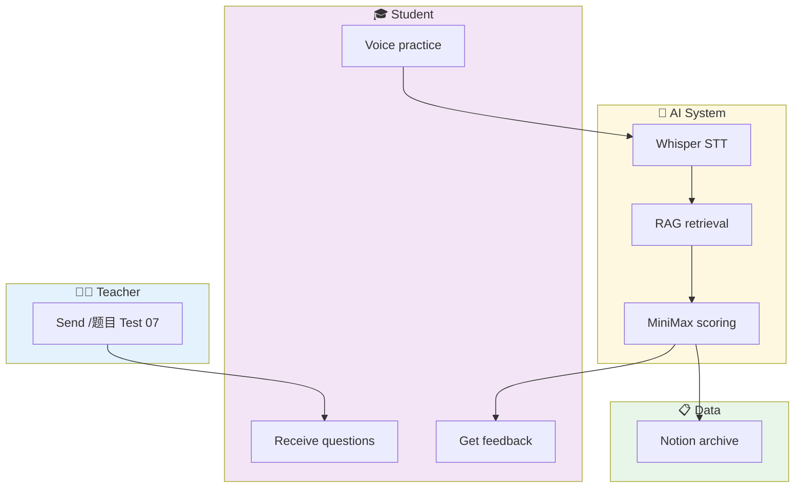

# 🎓 ielts-speaking-ai

<div align="center">

[](https://github.com/KaichenCurry/ielts-speaking-ai/stargazers)
[](LICENSE)
[](https://www.python.org/)
[](https://github.com/KaichenCurry/ielts-speaking-ai/commits)

**IELTS Speaking AI Assistant — Auto-grades for teachers, instant feedback for students**

[中文](./README.md) · [Documentation](./docs/SYSTEM_DESIGN.md) · [Resume](./docs/PORTFOLIO_RESUME.md)

</div>

---

## 🎯 What It Is

An AI-powered assistant for **IELTS speaking teachers**.

Teacher sends one command → Student practices with voice at home → AI auto-grades with sentence-by-sentence feedback → Results archived to Notion → Friday class report auto-pushed.

**One sentence: Free teachers from repetitive grading work.**

---

## ⚡ Quick Start

```bash
# 1. Clone the project
git clone https://github.com/KaichenCurry/ielts-speaking-ai.git
cd ielts-speaking-ai

# 2. Install dependencies
pip install -r requirements.txt

# 3. Configure environment
cp .env.example .env
# Edit .env and fill in your tokens

# 4. Run
python3 scripts/ielts_flow.py init '{"test_number": 7}'
python3 scripts/ielts_flow.py process /path/to/audio.wav
```

---

## 🔄 How It Works



---

## ✨ Key Features

### 📝 One-Click Assignment

Teacher sends one command, system auto-sends Part 1/2/3:

```
/题目 Test 07

✅ Part 1 sent (5 questions)
✅ Part 2 sent (Cue Card)
✅ Part 3 sent (5 questions)
```

### 🤖 AI Auto-Grading

| Component | Technology | Description |
|-----------|------------|-------------|
| Speech-to-text | Whisper | OpenAI open source, best for spoken English |
| Context enhancement | RAG | Retrieves historical errors for targeted scoring |
| AI scoring | MiniMax | 5-dimension sentence-by-sentence feedback |

### 📊 5-Dimension Feedback

| Dimension | Focus | Example |
|-----------|-------|---------|
| Grammar | Subject-verb, clauses | "He go" → "He goes" |
| Vocabulary | Chinglish, synonyms | "很贵" → "expensive" |
| Tense | Past/present/perfect | Past events in present tense |
| Logic | Causality, transitions | Example doesn't match point |
| Ideas | Examples, depth | Examples too general |

### 💾 Notion Auto-Archive

Every student practice permanently stored:
- Original transcript
- Band Score
- Sentence feedback
- Teacher corrections

📎 [Question Bank](https://www.notion.so/bba82871-4fe1-4409-9f70-72f6bf27e7b3) · 📎 [Homework](https://www.notion.so/3412e55d-7136-8179-9ac8-ee60a420ac21) · 📎 [Error Cases](https://www.notion.so/3412e55d-7136-8113-aa98-cfd36af9799c)

### 📈 Weekly Auto-Reports

Every Friday 18:00 → Auto-push to Telegram:
- Sessions, average Band
- Band distribution
- Common errors TOP5
- Next week teaching suggestions

---

## 📖 Real Example

**Student Answer**:
> "reading has been my hobby since I was a child and I've been a catering story books for fun, but now I'm preparing for my studies abroad and shifted to reading academic articles... It's a total problem of horizons."

**AI Feedback**:

| Original | Diagnosis | Suggestion |
|----------|-----------|------------|
| "reading has been my hobby since I was a child" | ✅ Tense correct | — |
| "I've been a catering story books" | ❌ Vocabulary: `catering` → `reading` | reading story books |
| "It's a total problem of horizons" | ❌ Chinglish | broadened my horizons |

**Band Score**: 6.0 / 9.0

---

## 🛠️ Tech Stack

| Component | Technology | Why |
|-----------|------------|-----|
| Message entry | Telegram | Native voice support, cross-platform, no barrier for students |
| AI inference | MiniMax (OpenClaw) | Great Chinese understanding, low cost |
| Speech-to-text | Whisper | Spoken English SOTA, open source, runs locally |
| Data storage | Notion | Teachers use directly, no backend needed |

**Band Formula**:
```
Overall Band = Part1×30% + (Part2×40% + Part3×60%)×70%
```

---

## 📁 Project Structure

```
ielts-speaking-ai/
├── README.md                     # This file
├── README_en.md                 # English version
├── LICENSE                      # MIT
├── requirements.txt             # Python dependencies
├── .env.example                # Environment template
│
├── scripts/                     # Core code
│   ├── ielts_flow.py          # Main controller
│   ├── answer_flow.py          # State machine (Part1→2→3)
│   ├── analyze_transcript.py  # AI scoring
│   ├── rag_retrieve.py        # RAG retrieval
│   ├── notion_append_homework.py
│   ├── notion_append_badcase.py
│   ├── notion_search.py
│   └── weekly_report.py
│
├── docs/                       # Documentation
│   ├── SYSTEM_DESIGN.md       # Technical docs
│   ├── PORTFOLIO_RESUME.md    # Resume content
│   └── INTERVIEW_PREP.md      # Interview prep
│
└── references/                # References
    ├── prompts.md
    └── prompt_changelog.md
```

---

## 🗺️ Roadmap

```
Now (v1.0) ─────────────────────────────────────────────────────

    └── WeChat / Feishu / Enterprise WeChat
            │
            ▼
    v1.1 (2026 Q2) ───────────────────────────────────────────

            └── Hermes Agent / Multi-agent / Vector RAG
                        │
                        ▼
                v1.2 (2026 Q3) ───────────────────────────────

                            └── Model fine-tuning / Student dashboard
                                    │
                                    ▼
                            v2.0 (2026 Q4) ────────────────
```

---

## 📊 Results

| Metric | Target | Actual |
|--------|--------|--------|
| Teacher time saved | 80%+ | ✅ |
| Band score error | ≤0.3 | **0.2** |
| Format accuracy | ≥98% | **98%+** |

> Based on April 2026 data (20+ sessions)

---

## 🔗 Links

| Resource | URL |
|----------|-----|
| GitHub | https://github.com/KaichenCurry/ielts-speaking-ai |
| Question Bank | https://www.notion.so/bba82871-4fe1-4409-9f70-72f6bf27e7b3 |
| Homework | https://www.notion.so/3412e55d-7136-8179-9ac8-ee60a420ac21 |
| Error Cases | https://www.notion.so/3412e55d-7136-8113-aa98-cfd36af9799c |

---

<div align="center">

**Give it a ⭐ if you find it useful!**

*Made by [Curry Chen](https://github.com/KaichenCurry)*

</div>
