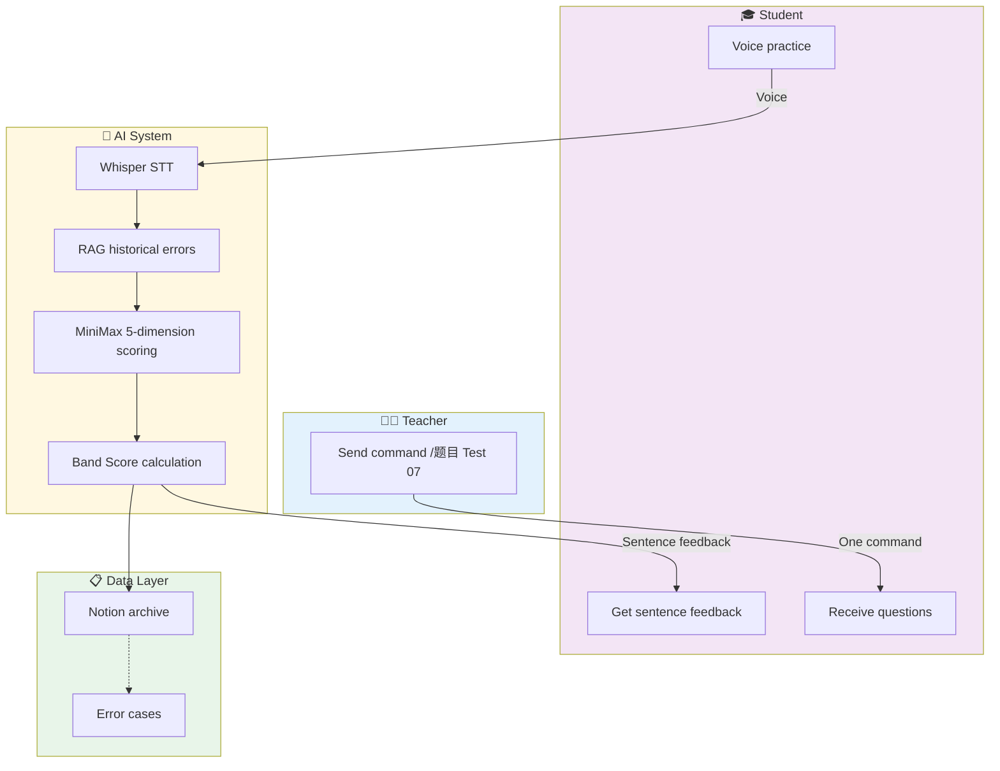

# 🎓 ielts-speaking-ai
# IELTS Speaking AI Assistant

> Auto-grades for teachers, so they can focus on teaching.

[](https://github.com/KaichenCurry/ielts-speaking-ai/stargazers)
[](LICENSE)
[](https://www.python.org/)
[](https://github.com/KaichenCurry/ielts-speaking-ai/commits)

🌐 **Language**: 🇺🇸 **English** | [🇨🇳 中文介绍](README.md)

---

## What It Is

An AI grading tool for **IELTS speaking teachers**.

Teacher sends one command → Student practices with voice → System auto-grades with sentence-by-sentence feedback → Archives to Notion → Pushes weekly reports.

---

## Core Flow



---

## Problem Solved

| Before (Teacher) | After (AI) |
|-----------------|------------|
| Manual grading, 3 hours per assignment | AI auto-grades, 0 seconds |
| Student waits a day for feedback | Instant after practice |
| Data scattered in WeChat/email | Auto-archived to Notion |
| Manual class progress tracking | Auto Friday weekly report |

---

## Results

| Metric | Value |
|--------|-------|
| Teacher time saved | **80%+** |
| Band score error | **0.2** |
| Format accuracy | **98%+** |

> Based on April 2026 data (20+ sessions)

---

## 5 Key Features

### 1️⃣ One-Click Assignment
Teacher sends `/题目 Test 07` → System auto-sends Part 1/2/3. 66 real exam questions ready.

### 2️⃣ AI Auto-Grading
```
Voice → Whisper → RAG → MiniMax → Score
```
MiniMax outputs 5-dimension feedback: Grammar / Vocabulary / Tense / Logic / Ideas

### 3️⃣ Instant Sentence Feedback

| Dimension | Focus | Example |
|-----------|-------|---------|
| Grammar | Subject-verb, clauses | "He go" → "He goes" |
| Vocabulary | Chinglish, synonyms | "很贵" → "expensive" |
| Tense | Past/present/perfect | Past events in present tense |
| Logic | Causality, transitions | Example doesn't match point |
| Ideas | Examples, depth | Examples too general |

### 4️⃣ Notion Auto-Archive

Every student practice permanently stored:
- Original transcript
- Band Score
- Sentence feedback
- Teacher corrections

📎 [Question Bank](https://www.notion.so/bba82871-4fe1-4409-9f70-72f6bf27e7b3) | 📎 [Homework](https://www.notion.so/3412e55d-7136-8179-9ac8-ee60a420ac21) | 📎 [Error Cases](https://www.notion.so/3412e55d-7136-8113-aa98-cfd36af9799c)

### 5️⃣ Weekly Auto-Reports

Every Friday 18:00 → Auto-push to Telegram:

```
📊 Class Weekly Report

Sessions: 12 | Avg Band: 6.2 | +0.3 vs last week

Band Distribution: 7.0+ (3) | 6.0-6.5 (6) | 5.5-6.0 (2)

Common Errors TOP3:
1. Tense mixing —— 8 times
2. Subject-verb disagreement —— 6 times
3. Example mismatch —— 5 times
```

---

## Real Example

**Student Answer**:
> "Definitely, yes, reading has been my hobby since I was a child and I've been a catering story books for fun, but now I'm preparing for my studies abroad and shifted to reading academic articles and biographies of influential figures. It's a total problem of horizons and improve my vocabulary."

**AI Feedback**:

| Original | Diagnosis | Suggestion |
|----------|-----------|------------|
| "reading has been my hobby since I was a child" | ✅ Tense correct | — |
| "I've been a catering story books for fun" | ❌ Vocabulary: `catering` → `reading` | → reading story books for fun |
| "shifted to reading academic articles" | ✅ Vocabulary accurate | — |
| "It's a total problem of horizons" | ❌ Chinglish | → It's really broadened my horizons |

**Band Score**: 6.0 / 9.0

---

## Tech Stack

| Component | Technology | Why |
|-----------|------------|-----|
| Message entry | Telegram | Native voice support, no barrier for students |
| AI inference | MiniMax (via OpenClaw) | Great Chinese understanding, low cost |
| Speech-to-text | Whisper (OpenAI) | Best for spoken English, open source |
| Data storage | Notion | Teachers use directly, no backend needed |

---

## Band Score Formula

```
Overall Band = Part1×30% + (Part2×40% + Part3×60%)×70%
```

**Example**:
```
Part1 avg: 6.0
Part2 score: 6.5
Part3 avg: 6.0

Part2_3 blend = 6.5×0.4 + 6.0×0.6 = 6.2
Overall Band = 6.0×0.3 + 6.2×0.7 = 6.14 ≈ 6.0
```

---

## Project Structure

```
ielts-speaking-ai/
├── scripts/                    # Core code
│   ├── ielts_flow.py         # Main controller
│   ├── answer_flow.py         # State machine (Part1→2→3)
│   ├── analyze_transcript.py # AI scoring
│   ├── rag_retrieve.py       # RAG retrieval
│   └── notion_append_*.py    # Notion archive
│
├── docs/
│   ├── SYSTEM_DESIGN.md      # Technical docs
│   ├── PORTFOLIO_RESUME.md   # Resume content
│   └── INTERVIEW_PREP.md    # Interview prep
│
└── references/
    └── prompts.md            # Prompt templates
```

---

## Quick Start

```bash
# 1. Clone
git clone https://github.com/KaichenCurry/ielts-speaking-ai.git
cd ielts-speaking-ai

# 2. Install
pip install -r requirements.txt

# 3. Configure
cp .env.example .env
# Edit .env with your tokens

# 4. Run
python3 scripts/ielts_flow.py init '{"test_number": 7}'
python3 scripts/ielts_flow.py process /path/to/audio.wav
```

---

## Roadmap

```
Now (v1.0) ─────────────────────────────────────────────────────────

    └── WeChat / Feishu / Enterprise WeChat
            │
            ▼
    v1.1 (2026 Q2) ───────────────────────────────────────────────

            └── Hermes Agent / Multi-agent / Vector RAG
                        │
                        ▼
                v1.2 (2026 Q3) ────────────────────────────────────

                            └── Model fine-tuning / Student dashboard / Feishu Docs
                                    │
                                    ▼
                            v2.0 (2026 Q4) ──────────────────────
```

---

## Links

| Resource | Link |
|----------|------|
| GitHub | https://github.com/KaichenCurry/ielts-speaking-ai |
| Question Bank | https://www.notion.so/bba82871-4fe1-4409-9f70-72f6bf27e7b3 |
| Homework | https://www.notion.so/3412e55d-7136-8179-9ac8-ee60a420ac21 |
| Error Cases | https://www.notion.so/3412e55d-7136-8113-aa98-cfd36af9799c |

---

**Curry Chen** | [GitHub](https://github.com/KaichenCurry)

<p align="center"><strong>⭐ Star this project!</strong></p>
