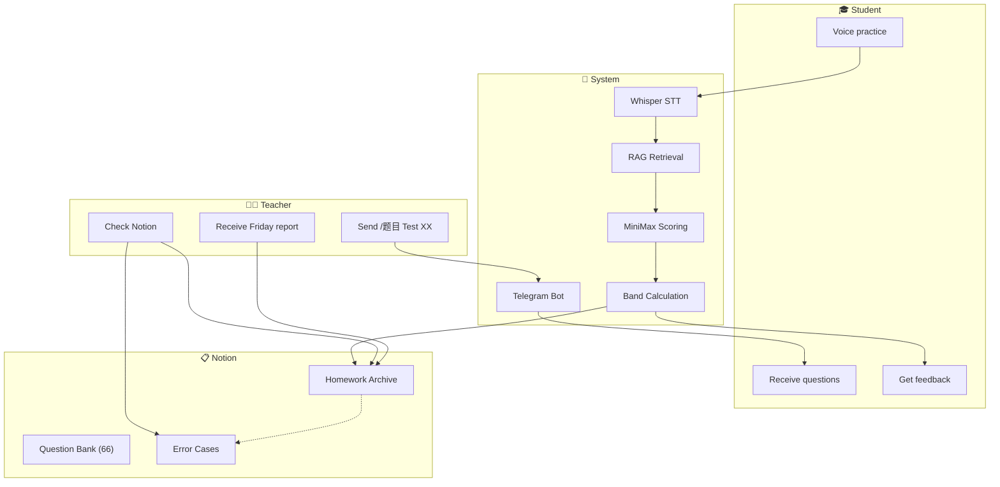
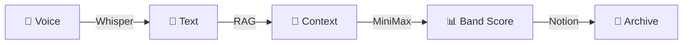
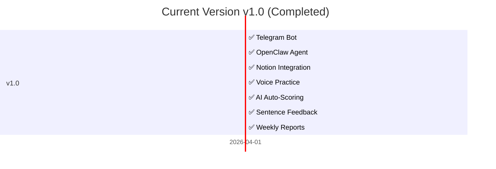

# 🎓 ielts-speaking-ai
# IELTS Speaking AI Assistant

> Free teachers from repetitive grading, let them focus on real teaching.

[](https://github.com/KaichenCurry/ielts-speaking-ai/stargazers)
[](LICENSE)
[](https://www.python.org/)
[](https://github.com/KaichenCurry/ielts-speaking-ai/commits)

🌐 **Language**: 🇺🇸 **English** | [🇨🇳 中文介绍](README.md)

---

## 📋 Table of Contents

- [🎯 What is this?](#-what-is-this)
- [😤 The Problem](#-the-problem)
- [💡 Our Solution](#-our-solution)
- [🏗️ Tech Stack](#️-tech-stack)
- [✨ Features](#-features)
- [📖 Demo](#-demo)
- [📁 Structure](#-structure)
- [🗺️ Roadmap](#️-roadmap)
- [🚀 Quick Start](#-quick-start)

---

## 🎯 What is this?

### One-sentence

An AI-powered assistant for **IELTS speaking teachers** — one command to assign homework, students practice with voice, system auto-grades, provides sentence-by-sentence feedback, archives to Notion, and pushes weekly reports.

### What Problem It Solves

| User | Problem | Solution |
|------|---------|----------|
| Teachers | Repetitive grading | AI auto-grades, 80%+ time saved |
| Teachers | Delayed feedback | Instant feedback after practice |
| Teachers | Scattered data | Notion archives, searchable |
| Teachers | No class overview | Auto Friday weekly reports |

---

## 😤 The Problem

### Before vs After

```
┌─────────────────────────────────────────────────────────────────────┐
│                        BEFORE (Manual)                              │
├─────────────────────────────────────────────────────────────────────┤
│                                                                      │
│   📋 Teacher receives 20 assignments                                │
│        ↓                                                             │
│   ⏱️ Manual grading → 3 hours of repetitive work                    │
│        ↓                                                             │
│   😤 Student: "When will I get feedback?"                           │
│        ↓                                                             │
│   📝 Papers scattered → No data → No tracking                        │
│                                                                      │
└─────────────────────────────────────────────────────────────────────┘
                              ↓
                   🎯 ielts-speaking-ai ↓
                              ↓
┌─────────────────────────────────────────────────────────────────────┐
│                        AFTER (AI-Powered)                            │
├─────────────────────────────────────────────────────────────────────┤
│                                                                      │
│   👨‍🏫 Teacher → /题目 Test 07    ⌨️ One command                      │
│        ↓                                                             │
│   ✅ System sends Part 1/2/3 automatically                          │
│        ↓                                                             │
│   🎤 Student voice → 📊 AI grades → 💬 Sentence feedback           │
│        ↓                                                             │
│   📋 Notion archives + 📈 Friday auto report                         │
│        ↓                                                             │
│   👨‍🏫 Teacher focuses on teaching, not grading                       │
│                                                                      │
└─────────────────────────────────────────────────────────────────────┘
```

---

## 💡 Our Solution

### Complete Workflow



---

## 🏗️ Tech Stack

### Why These Three?

```
┌─────────────────────────────────────────────────────────────────────┐
│                                                                      │
│   ┌─────────────┐     ┌─────────────┐     ┌─────────────┐          │
│   │    📱       │     │    🤖       │     │    📋       │          │
│   │  Telegram   │  +  │  OpenClaw   │  +  │   Notion    │          │
│   │─────────────│     │─────────────│     │─────────────│          │
│   │ 🌐 Messaging│     │ 🧠 AI Agent │     │ 📊 Storage  │          │
│   │ 🎤 Voice    │     │ 🔄 Workflow │     │ 📝 Struct.  │          │
│   │ 📱 Cross-pl │     │ 🌐 Chinese  │     │ 🔗 API     │          │
│   └─────────────┘     └─────────────┘     └─────────────┘          │
│                                                                      │
└─────────────────────────────────────────────────────────────────────┘
```

| Platform | Advantage | Why |
|----------|-----------|-----|
| **Telegram** | Native voice | Voice messages, no extra setup |
| **OpenClaw** | AI Agent | Whisper + MiniMax + RAG built-in |
| **Notion** | Structured data | Teacher-friendly, API-enabled |

### AI Pipeline



---

## ✨ Features

### 1️⃣ One-Click Assignment
```
Command: /题目 Test 07

✅ Part 1 sent (5 questions)
✅ Part 2 sent (Cue Card)
✅ Part 3 sent (5 questions)
```
66 real exam questions.

### 2️⃣ AI Auto-Scoring

| Component | Technology | Function |
|-----------|------------|----------|
| 🎤 Speech-to-Text | Whisper | Voice → Text |
| 📚 Context | RAG | Historical errors enhance |
| 🧠 Scoring | MiniMax | 5-dimension evaluation |
| 📊 Band Calc | Formula | Part1×30% + (Part2×40%+Part3×60%)×70% |

### 3️⃣ 5-Dimension Feedback

| Dimension | Focus | Example |
|-----------|-------|---------|
| 📝 Grammar | Subject-verb, clauses | "He go" → "He goes" |
| 📖 Vocabulary | Chinglish, synonyms | "很贵" → "expensive" |
| ⏰ Tense | Past/present/perfect | Past events in present |
| 🔗 Logic | Causality, transitions | Example doesn't match point |
| 💡 Ideas | Examples, depth | Examples too general |

### 4️⃣ Notion Integration

📎 [Question Bank](https://www.notion.so/bba82871-4fe1-4409-9f70-72f6bf27e7b3) | 📎 [Homework Archive](https://www.notion.so/3412e55d-7136-8179-9ac8-ee60a420ac21) | 📎 [Error Cases](https://www.notion.so/3412e55d-7136-8113-aa98-cfd36af9799c)

### 5️⃣ Weekly Reports

Every Friday 18:00 → Auto-push to Telegram

---

## 📖 Demo

### Student Answer → AI Feedback

**Transcript**:
> "Definitely, yes, reading has been my hobby since I was a child and I've been a catering story books for fun..."

**AI Feedback**:

| Sentence | Grammar | Vocabulary | Tense | Logic | Ideas |
|----------|---------|-----------|-------|-------|-------|
| "reading has been my hobby since I was a child" | ✅ | ✅ | ✅ | ✅ | ✅ |
| "I've been a catering story books" | ✅ | ❌ `catering` → `reading` | ✅ | ✅ | ✅ |
| "It's a total problem of horizons" | ✅ | ❌ Chinglish → `broadened my horizons` | ✅ | ✅ | ✅ |

**Result**: Band Score **6.0 / 9.0**

---

## 📁 Structure

```
┌─────────────────────────────────────────────────────────────────────┐
│                       Project Structure                              │
├─────────────────────────────────────────────────────────────────────┤
│                                                                      │
│  📄 README.md              ← Chinese version (default)               │
│  📄 README_en.md           ← English version (this file)              │
│  📄 LICENSE                ← MIT License                              │
│  📄 .env.example           ← Environment template                   │
│  📄 requirements.txt        ← Python dependencies                   │
│                                                                      │
│  ┌─────────────────────────────────────────────────────────────┐   │
│  │  📁 scripts/                 Core Scripts                   │   │
│  ├─────────────────────────────────────────────────────────────┤   │
│  │  ⭐ ielts_flow.py           Main controller                │   │
│  │  ⭐ answer_flow.py           State machine (Part1→2→3)   │   │
│  │  ⭐ analyze_transcript.py   AI scoring                    │   │
│  │  ⭐ rag_retrieve.py         RAG retrieval                  │   │
│  │  📱 notion_*.py             Notion integration              │   │
│  │  🔄 weekly_report.py         Weekly report                  │   │
│  └─────────────────────────────────────────────────────────────┘   │
│                                                                      │
│  ┌─────────────────────────────────────────────────────────────┐   │
│  │  📁 docs/                    Documentation                   │   │
│  ├─────────────────────────────────────────────────────────────┤   │
│  │  📋 SYSTEM_DESIGN.md        Technical docs                 │   │
│  │  📋 PORTFOLIO_RESUME.md     Resume & Portfolio             │   │
│  └─────────────────────────────────────────────────────────────┘   │
│                                                                      │
└─────────────────────────────────────────────────────────────────────┘
```

---

## 🗺️ Roadmap

### Current ✅ v1.0



### Future 🔜

| Version | Timeline | Features | Status |
|---------|----------|----------|--------|
| **v1.1** | 2026 Q2 | WeChat Mini Program | 🔜 |
| | | Feishu/Lark Bot | 🔜 |
| | | Enterprise WeChat | 🔜 |
| **v1.2** | 2026 Q3 | Hermes Agent | 🔜 |
| | | Multi-Agent | 🔜 |
| | | Vector RAG | 🔜 |
| **v2.0** | 2026 Q4 | Feishu Docs | 🔜 |
| | | Tencent Docs | 🔜 |
| | | Model Fine-tuning | 🔜 |
| | | Student Dashboard | 🔜 |

---

## 🚀 Quick Start

### 1. Clone
```bash
git clone https://github.com/KaichenCurry/ielts-speaking-ai.git
cd ielts-speaking-ai
```

### 2. Install
```bash
pip install -r requirements.txt
```

### 3. Configure
```bash
cp .env.example .env
# Edit .env with your tokens
```

### 4. Run
```bash
python3 scripts/ielts_flow.py init '{"test_number": 7}'
python3 scripts/ielts_flow.py process /path/to/audio.wav
```

---

## 📊 Metrics

> ⚠️ **Disclaimer**: Based on limited data (20+ sessions, April 2026).

| Metric | Target | Actual |
|--------|--------|--------|
| Band Error | ≤0.3 | **0.2** |
| Format Accuracy | ≥98% | **98%+** |

---

## 👤 Author

**Curry Chen** | [GitHub](https://github.com/KaichenCurry) | [Project](https://github.com/KaichenCurry/ielts-speaking-ai)

---

## 📜 License

[MIT License](LICENSE)

---

<p align="center">
  <strong>⭐ Star this project if you find it helpful!</strong>
</p>
