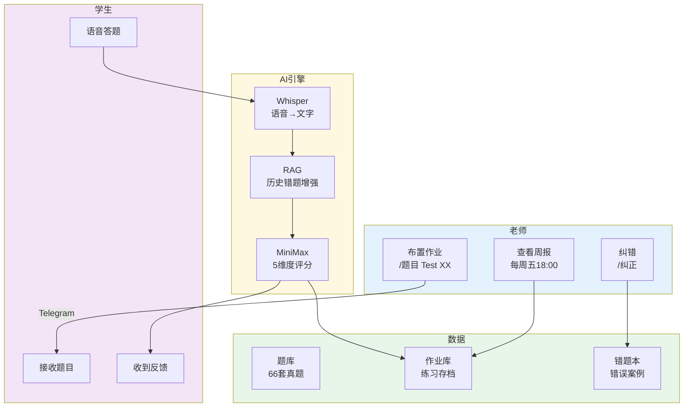
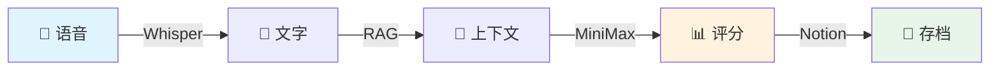
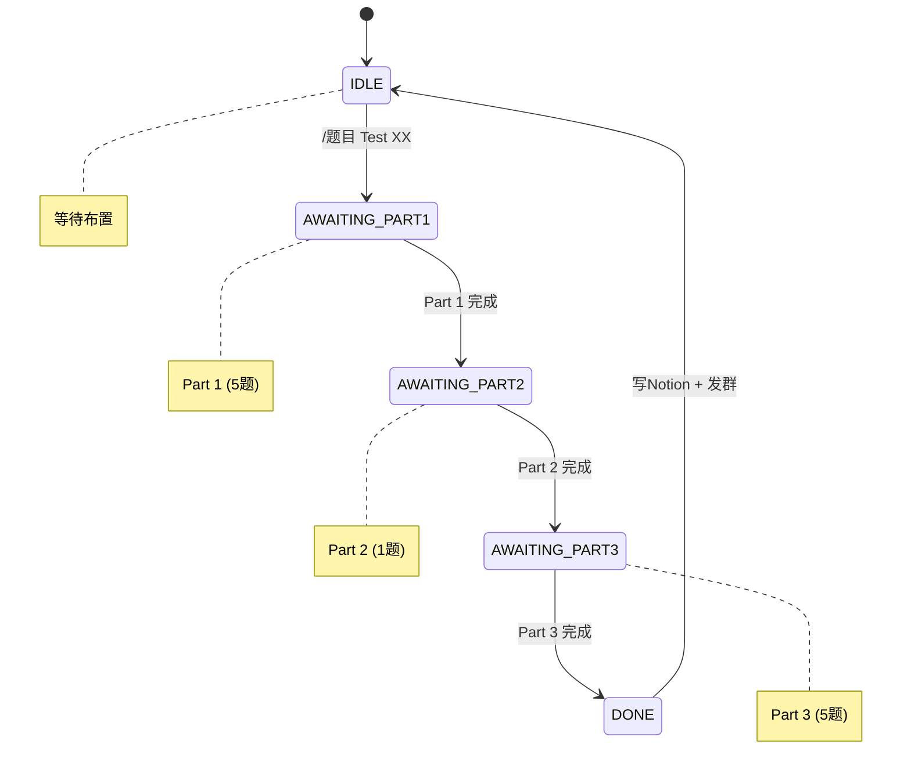
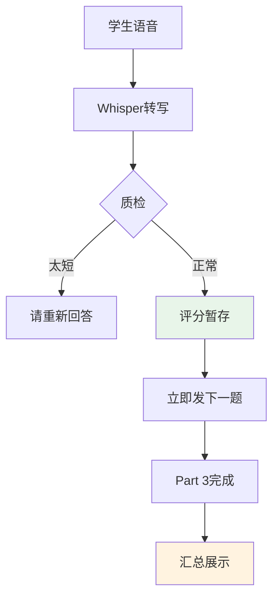
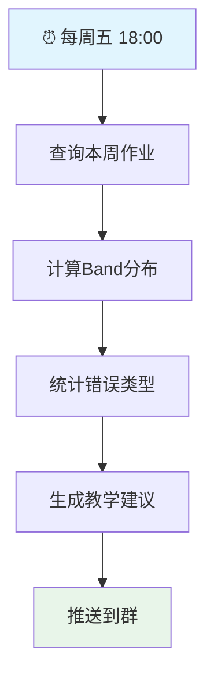

# 简历 & 作品集内容
# 雅思口语 AI 助教系统

---

## 一、简历直接可用的项目经历

### 项目名称
**雅思口语 AI 助教系统（赵同学 Telegram Bot）**

### 项目定位（一句话）
面向雅思口语教师的 AI 辅助教学工具，实现作业布置→AI评测→逐句反馈→Notion存档→周报分析全流程自动化，让老师专注于真正的教学干预。

---

### 简历描述（5条，每条符合"动作+方法+结果"）

#### 描述 1：产品设计
> 从 0 到 1 设计并落地雅思口语 AI 助教系统，打造「作业布置→AI评测→逐句反馈→Notion存档→周报分析」完整产品闭环，深度服务雅思口语教师群体。

#### 描述 2：AI 能力产品化
> 设计多模型协同架构（Whisper语音转写 + MiniMax评分推理 + RAG历史错题增强），实现逐句多维度反馈（语法/词汇/时态/逻辑/思路），Band评分误差从0.5收窄至0.2，格式正确率98%+。

#### 描述 3：辅助教学定位
> 产品聚焦「AI助教」而非「AI评分器」，核心价值在于解放老师重复性工作（减少80%+评分工作量），让老师从「评分员」变成「教学干预者」。

#### 描述 4：工具型产品思维
> 面向教师群体设计工具型产品，支持一键布置66套真题作业、Notion作业库随时调取历史数据、每周五自动推送班级全景周报，老师无需手动统计，周五早上2分钟看完班级全貌。

#### 描述 5：数据驱动与自动化运营
> 建立AI评测指标体系（Band误差、维度准确率、错题命中率），每周五18:00自动评估迭代；题库每周三、六自动更新扩充，全程无人值守运营。

---

### 关键词（ATS友好）
```
AI产品经理 | 教育科技 | 辅助教学工具 | Whisper | RAG | Prompt Engineering
多模型协同 | 雅思口语 | 教师工具 | Notion API | 状态机设计 | 跨系统集成
Telegram Bot | 数据驱动 | 自动化运营 | 周报推送 | 题库管理
```

---

## 二、作品集展示版本

### 项目背景

#### 市场痛点
雅思口语教师面临四大核心痛点：

| 痛点 | 现状 | 影响 |
|------|------|------|
| 重复性工作繁重 | 每次作业手动评分 | 耗时耗力，无暇教学设计 |
| 反馈严重滞后 | 学生次日甚至更久才收到反馈 | 错失最佳记忆窗口 |
| 数据散落丢失 | 学生记录难以追踪 | 无法形成系统化教学档案 |
| 班级进度黑盒 | 手动统计费时费力 | 难以针对性调整教学 |

#### 我的思考
> 能不能做一个系统，让老师只需一条指令布置作业，剩下的评分、反馈、存档工作全部由AI完成？老师从「评分员」变成「教学干预者」，把精力放在真正的教学设计上。

---

### 产品设计

#### 产品架构图



#### 核心功能矩阵

| 功能 | 老师操作 | 系统自动完成 | 学生感受 |
|------|---------|-------------|---------|
| 布置作业 | `/题目 Test XX` | 解析+发送Part1/2/3 | 收到全部题目 |
| AI评测 | — | Whisper+RAG+MiniMax | 语音答题 |
| 逐句反馈 | — | 5维度逐句分析 | 即时收到 |
| 数据存档 | Notion随时查 | 写入作业库+错题本 | 历史留存 |
| 班级周报 | 每周五收到推送 | 统计+生成+推送 | 了解班级 |

---

### AI 能力设计

#### 多模型协同架构



#### 评分维度设计

| 维度 | 关注点 | 示例 |
|------|--------|------|
| 语法 | 主谓一致、从句、介词 | "He go" → "He goes" |
| 词汇 | Chinglish、高分替换 | "很贵" → "expensive" |
| 时态 | 过去/现在/完成时 | 过去经历用现在时 |
| 逻辑 | 因果、转折、跑题 | 观点与举例不匹配 |
| 思路 | 举例、深度、观点 | 举例泛泛而谈 |

#### Band Score 计算

```
综合 Band = Part1×30% + (Part2×40% + Part3×60%)×70%
```

---

### 状态机设计

#### 三段式流程



#### 异步评分设计



**设计思考**：口语考试要求学生连续说1-2分钟，异步架构消除等待感；同时反馈不在答题过程中展示，避免影响学生心态。

---

### 题库管理体系

#### 话题分类

| 大类 | 话题数 | 示例 |
|------|--------|------|
| 人物类 | 10+ | 家人、朋友、名人、老师 |
| 地点类 | 10+ | 博物馆、公园、餐厅、商场 |
| 物品类 | 10+ | 礼物、收藏品、衣服、照片 |
| 事件类 | 15+ | 旅行、婚礼、童年、冒险 |
| 活动类 | 10+ | 运动、电影、音乐、游戏 |
| 习惯类 | 5+ | 健康习惯、晨间routine |
| 食物类 | 5+ | 喜欢的餐厅、喜欢的水果 |

#### 自动更新机制

| 时间 | 任务 |
|------|------|
| 每周三凌晨 02:00 | 自动更新题库 |
| 每周六凌晨 02:00 | 自动更新题库 |
| 随时 | 老师可发 `/更新题库` 手动触发 |

---

### 周报分析体系

#### 周报推送流程



#### 周报内容

```
📊 班级周报 | 2026.04.11-04.15

【本周练习概览】
• 练习人次：12
• 平均 Band：6.2
• 较上周变化：+0.3 ↑

【Band分布】
• 7.0+：3人
• 6.0-6.5：6人
• 5.5-6.0：2人

【常见错误TOP5】
1. 时态混用——8次
2. 主谓不一致——6次
3. 举例与观点不匹配——5次

【下周教学建议】
• 重点关注时态一致性
• 加强举例具体化训练
```

---

### 推进过程

#### Phase 1：产品定义
- 深度访谈 Curry 老师，梳理雅思口语教学全流程
- 识别最高频、最耗时的环节：重复性评分工作
- 明确核心价值主张：解放老师，专注教学干预

#### Phase 2：功能设计
- 作业管理：66套真题，一键布置
- AI评测：Whisper + MiniMax + RAG 协同
- 数据存档：Notion 统一管理
- 周报推送：每周五自动生成

#### Phase 3：AI产品化
- 设计多模型串联方案
- 核心挑战：答题时不能让学生看到反馈（影响心态），但又要即时追问下一题
- 解决方案：异步评分架构，录音后立即发下一题，全部答完才展示反馈

#### Phase 4：自动化运营
- 题库每周三、六自动更新
- 周报每周五18:00自动推送
- 老师从「每件事都要管」变成「只处理真正需要人介入的事」

#### Phase 5：数据体系建设
- 设计周级评估机制，Band误差等指标量化AI质量
- Prompt迭代2轮：Band误差从0.5降至0.2，格式正确率从78%提升至98%

---

### 最终结果

| 指标 | 数值 |
|------|------|
| 题库规模 | 66套真题，66个独特话题 |
| Band评分误差 | ≤0.3（实际0.2） |
| 格式正确率 | 98%+ |
| 老师效率提升 | 重复性评分工作减少80%+ |
| 周报自动化 | 每周五18:00自动推送 |
| 题库自动更新 | 每周三、六凌晨自动更新 |
| 产品闭环完整性 | 布置→评测→反馈→存档→周报，全链路 |

---

### 复盘与优化点

#### 做得好的
- 产品闭环完整，真正解决了教学痛点
- AI能力设计克制，没有为了用技术而用技术
- 工具型产品思维：老师用起来真的省事
- 数据飞轮设计为后续能力进化留足空间

#### 可以优化的
- 缺少学生主动提问的入口
- RAG目前是轻量版，数据量上来后需升级向量检索
- 错题本积累到100条后可启动微调验证

---

## 三、面试高频 Q&A

### Q1：为什么选择做教师工具而不是学生工具？

**Answer**：
从商业价值和使用频次考虑：
1. **付费意愿**：老师是专业从业者，付费意愿和能力都更强
2. **使用频次**：老师每天可能要处理多个学生的作业，是高频场景
3. **决策链**：老师的推荐能带来批量学生，比单独获客更高效

更重要的是，我从一开始就和 Curry 老师深度共创，她是最真实的用户，她的需求就是我的产品方向。

---

### Q2：这个项目和市面上其他AI口语产品有什么区别？

**Answer**：
市面上大多数产品是「学生端工具」，给个分数就结束了。我的定位是**「老师端助教系统」**：
1. **不是打分器，是助教**：逐句告诉你哪里有问题、怎么改
2. **不是学生工具，是老师工具**：老师布置作业、管理题库、查看周报
3. **完整闭环**：不是单一功能，而是从布置到反馈到存档到周报的全链路

---

### Q3：Band评分怎么保证准确性？

**Answer**：
三层保障：
1. **RAG增强**：融合历史错题和同类回答，让评分模型有上下文参考
2. **Prompt迭代**：通过周级评估发现Band偏差，持续优化Prompt，误差从0.5收窄到0.2
3. **老师纠正**：`/纠正`机制让老师可以修正AI评分，每一次纠正都是高质量标注数据

---

### Q4：遇到最大的产品挑战是什么？

**Answer**：
最大的挑战不是技术，而是产品设计上的两难：
- **即时反馈 vs 考试心态**：学生答题时如果立即看到反馈，会过度关注单题表现
- **即时追问 vs 评分延迟**：口语考试要求学生连续说1-2分钟，如果等学生说完再评分再发下一题，会有等待间隙

**解决方案**：异步评分架构。录音后立即发下一题，后台并发评分，全部答完才展示反馈。这需要在状态机上做精细的设计，但体验流畅多了。

---

### Q5：周报系统是怎么设计的？

**Answer**：
周报系统的价值在于**让老师无需手动统计就能掌握班级全景**：
- **时间触发**：每周五18:00自动运行
- **数据来源**：从Notion作业库中查询本周所有练习记录
- **分析维度**：练习人次、平均Band、Band分布、常见错误TOP5
- **输出形式**：Telegram群推送，格式化成表，老师2分钟看完

---

## 四、GitHub 链接

**仓库地址**：https://github.com/KaichenCurry/ielts-speaking-ai

📎 **Notion 数据库链接**（需登录）：
- [题库](https://www.notion.so/bba82871-4fe1-4409-9f70-72f6bf27e7b3)
- [作业反馈库](https://www.notion.so/3412e55d-7136-8179-9ac8-ee60a420ac21)
- [错题本](https://www.notion.so/3412e55d-7136-8113-aa98-cfd36af9799c)

---

## 五、适合投递的岗位

| 岗位类型 | 匹配度 |
|---------|--------|
| AI 产品经理 | ⭐⭐⭐⭐⭐ |
| AI 应用产品经理 | ⭐⭐⭐⭐⭐ |
| 教育AI产品经理 | ⭐⭐⭐⭐⭐ |
| toB AI产品经理 | ⭐⭐⭐⭐ |
| SaaS产品经理 | ⭐⭐⭐⭐ |

---

*最后更新：2026-04-16*
*GitHub：https://github.com/KaichenCurry/ielts-speaking-ai*
