# 雅思口语 AI 练习与评测系统 - 详细设计文档

> 本文档面向面试官和潜在合作者，详细说明系统设计思路、产品思考和技术实现。
>
> ⚠️ **可信度说明**：本文档中的指标数据（Band 误差、格式正确率等）基于 2026-04 运营数据，样本量有限（20+ 次练习），仅供参考。

---

## 一、项目背景与产品定位

### 1.1 产品定位

**一句话定位**：面向雅思口语教师的 AI 辅助教学工具，让老师从重复性评分工作中解放，专注于真正的教学干预。

### 1.2 目标用户

| 用户 | 角色 | 核心需求 |
|------|------|---------|
| 雅思口语教师 | 决策者 + 使用者 | 高效布置作业、查看学生进度、掌握班级全景 |
| 雅思备考学生 | 最终受益者 | 即时反馈、持续练习、了解进步轨迹 |

### 1.3 解决的四大痛点

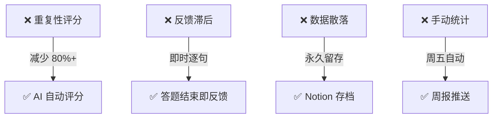

---

## 二、完整产品架构

### 2.1 系统全景图

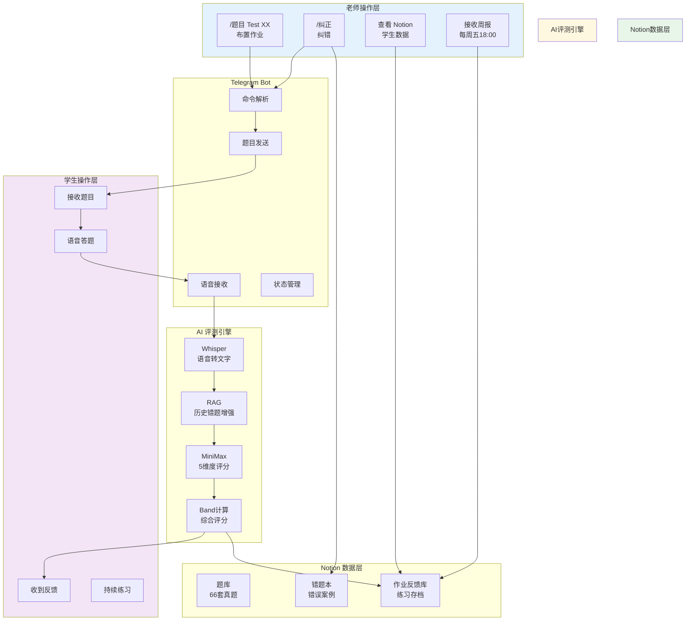

### 2.2 五大功能模块

```mermaid
flowchart LR
    subgraph F1["作业管理"]
        F1A["一键布置"]
        F1B["题库搜索"]
        F1C["66套真题"]
    end
    
    subgraph F2["AI 评测"]
        F2A["Whisper"]
        F2B["RAG"]
        F2C["MiniMax"]
    end
    
    subgraph F3["数据存档"]
        F3A["Notion"]
        F3B["作业库"]
        F3C["错题本"]
    end
    
    subgraph F4["周报分析"]
        F4A["自动生成"]
        F4B["定时推送"]
        F4C["班级全景"]
    end
    
    subgraph F5["题库管理"]
        F5A["自动更新"]
        F5B["话题去重"]
        F5C["66个独特话题"]
    end
    
    F1 --> F2
    F2 --> F3
    F3 --> F4
    F4 --> F5
```

---

## 三、核心功能详解

### 3.1 作业管理模块

#### 布置作业流程

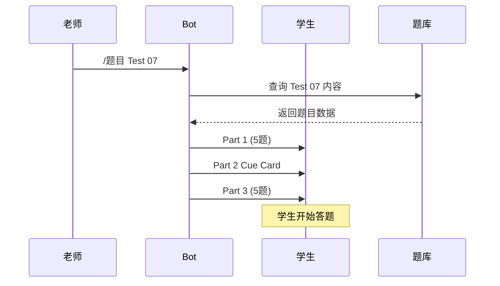

#### 题库结构

| 字段 | 说明 | 示例 |
|------|------|------|
| 编号 | Test 编号 | 1-66 |
| 题目 | 完整题目名称 | "Test 07 · 商场" |
| 类型 | 话题分类 | 地点/人物/物品/事件 |
| 难度 | 基础/中等/进阶 | 中等 |
| 练习状态 | 新增待练习/已练习 | 已练习 |

#### 话题分类体系

| 大类 | 话题数 | 示例 |
|------|--------|------|
| 人物类 | 10+ | 家人、朋友、名人、老师 |
| 地点类 | 10+ | 博物馆、公园、餐厅、商场 |
| 物品类 | 10+ | 礼物、收藏品、衣服、照片 |
| 事件类 | 15+ | 旅行、婚礼、童年、冒险 |
| 活动类 | 10+ | 运动、电影、音乐、游戏 |
| 习惯类 | 5+ | 健康习惯、晨间 routine |
| 食物类 | 5+ | 喜欢的餐厅、喜欢的水果 |

### 3.2 AI 评测模块

#### 多模型协同架构

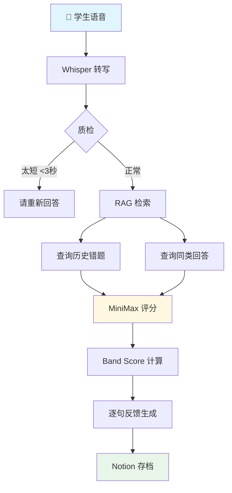

#### 评分维度

| 维度 | 关注点 | 示例问题 |
|------|--------|---------|
| 语法 | 主谓一致、从句使用、介词搭配 | "He go" → "He goes" |
| 词汇 | Chinglish、同义词替换、高分词汇 | "很贵" → "expensive" |
| 时态 | 过去时、现在时、完成时 | 过去经历用现在时 |
| 逻辑 | 因果关系、转折、层次感、跑题 | 观点与举例不匹配 |
| 思路 | 举例是否具体、论证深度、独特观点 | 举例泛泛而谈 |

#### Band Score 计算

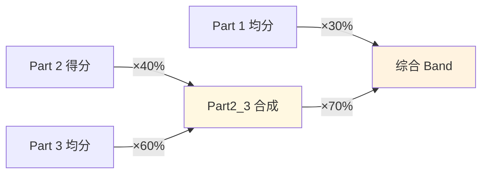

**计算示例**：
```
Part 1 均分：6.0
Part 2 得分：6.5
Part 3 均分：6.0

Part2_3 合成 = 6.5×0.4 + 6.0×0.6 = 2.6 + 3.6 = 6.2
综合 Band = 6.0×0.3 + 6.2×0.7 = 1.8 + 4.34 = 6.14 ≈ 6.0
```

### 3.3 状态机设计

#### 三段式流程

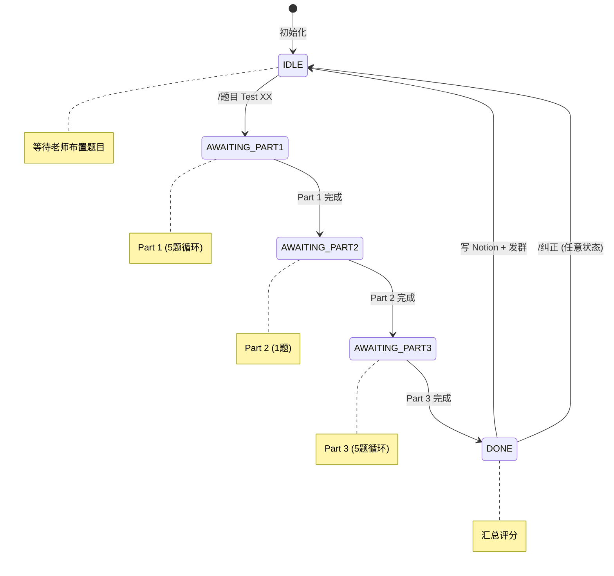

#### 异步评分设计

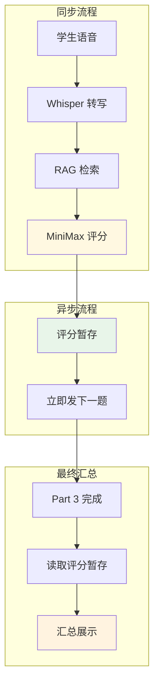

**设计理由**：口语考试要求学生连续说 1-2 分钟，异步架构让流程如行云流水，消除等待感。

### 3.4 数据存档模块

#### Notion 数据库关系

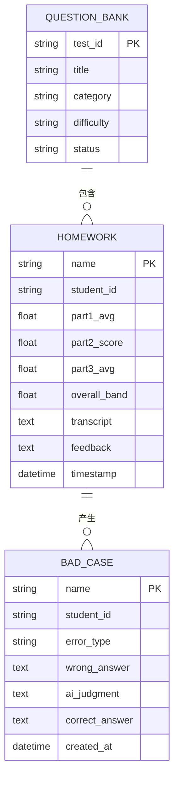

📎 **Notion 数据库链接**（需登录）：
- [题库](https://www.notion.so/bba82871-4fe1-4409-9f70-72f6bf27e7b3)
- [作业反馈库](https://www.notion.so/3412e55d-7136-8179-9ac8-ee60a420ac21)
- [错题本](https://www.notion.so/3412e55d-7136-8113-aa98-cfd36af9799c)

### 3.5 错题本模块

#### 纠错流程

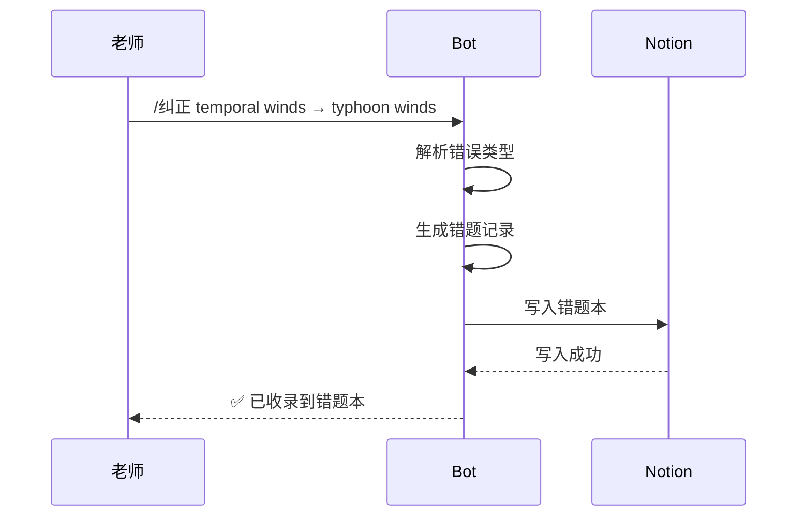

#### 错题本数据结构

| 字段 | 说明 |
|------|------|
| 学生ID | 识别来源 |
| 原始题目 | 出错题目 |
| 错误类型 | 语法/词汇/时态/逻辑/思路 |
| 学生错误答案 | 原始回答 |
| AI 原评判 | AI 当初判断 |
| 老师正确纠正 | 专家标注 |

### 3.6 周报分析模块

#### 周报生成流程

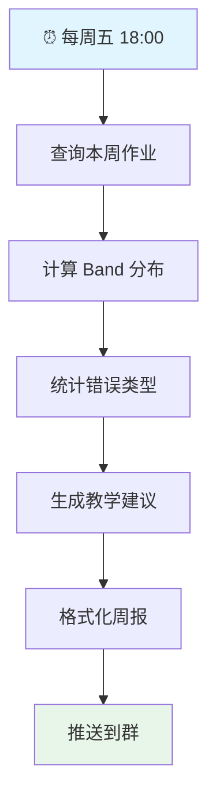

#### 周报内容模板

```
📊 班级周报 | 2026.04.11-04.15

═══════════════════════════════════════
【本周练习概览】
═══════════════════════════════════════
• 练习人次：12
• 平均 Band：6.2
• 较上周变化：+0.3 ↑

═══════════════════════════════════════
【Band 分布】
═══════════════════════════════════════
• 7.0+：3人 ████
• 6.0-6.5：6人 ████████████
• 5.5-6.0：2人 ████
• 5.0 以下：1人 ██

═══════════════════════════════════════
【常见错误 TOP5】
═══════════════════════════════════════
1. 🔴 时态混用（过去时 vs 现在时）—— 8次
2. 🟡 主谓不一致 —— 6次
3. 🟡 举例与观点不匹配 —— 5次
4. 🟢 Chinglish 表达 —— 4次
5. 🟢 论证深度不足 —— 3次

═══════════════════════════════════════
【下周教学建议】
═══════════════════════════════════════
• 重点关注时态一致性训练
• 加强举例具体化引导
• 建议学生背诵高分词汇替换表
```

---

## 四、题库自动更新机制

### 4.1 更新策略

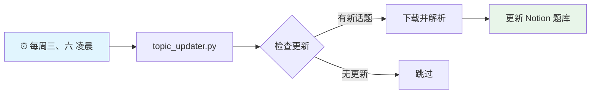

### 4.2 话题去重机制

| 问题 | 解决方案 |
|------|---------|
| 之前 66 个 Test 只用 10 个循环话题 | `update_unique.py` 预定义 66 个独特话题 |
| 每话题重复 6-7 次 | 确保每个话题只出现一次 |
| 学生练习效率低 | 66 个独特话题，全新体验 |

---

## 五、AI 评测指标体系

### 5.1 核心指标

| 指标 | 计算方式 | 目标 | 实际 |
|------|---------|------|------|
| Band 误差 | \|AI Band - 老师纠正 Band\| | ≤0.3 | **0.2** ✅ |
| 维度准确率 | AI 错误标记被老师确认比例 | ≥85% | 达标 ✅ |
| 错题命中率 | AI 识别错误中真正存在比例 | ≥80% | 达标 ✅ |
| 格式正确率 | 评分输出符合格式要求 | ≥98% | **98%+** ✅ |

### 5.2 评估触发机制

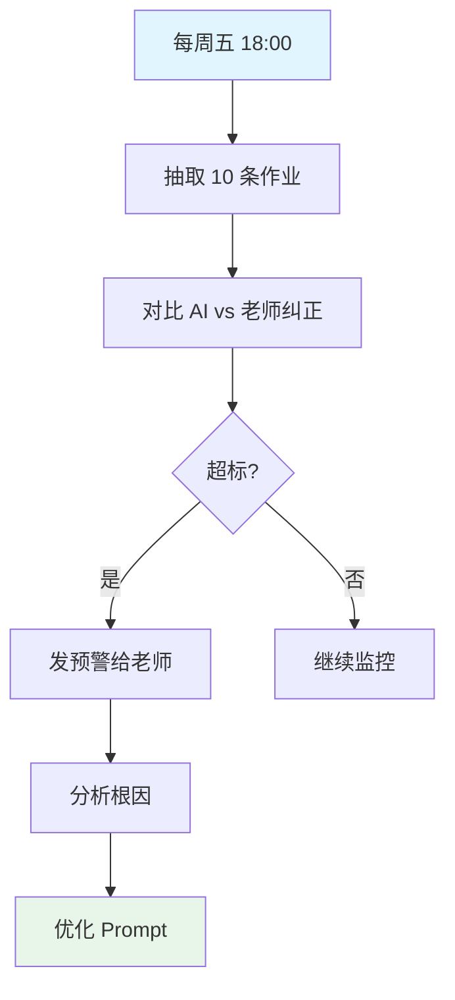

---

## 六、Prompt 设计

### 6.1 评分 Prompt 结构

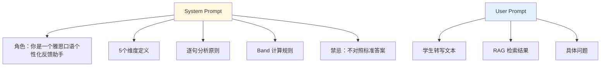

### 6.2 逐句反馈格式

```
原句： "I've been a catering story books for fun."

• 语法：❌ "a catering story books" → "catering story books"（不可数名词）
• 词汇：⚠️ "catering" 词性误用 → 应为 "reading"
• 时态：✅ 过去时使用正确
• 逻辑：✅ 表达清晰

───

原句： "It's a total problem of horizons."

• 语法：⚠️ "total problem" 表达不准确
• 词汇：❌ "problem of horizons" Chinglish → "broaden my horizons"
• 时态：✅ 表述清晰
• 逻辑：✅ 上下文衔接自然
```

### 6.3 Prompt 迭代记录

| 版本 | 日期 | 问题 | 修改 | 效果 |
|------|------|------|------|------|
| V2 | 2026-04-13 | 维度名称不统一 | 统一为5维度中文名称 | 格式一致性 **78%→98%** |
| V1 | 2026-04-11 | Band 系统性偏高 0.5 | 增加校准规则 | 误差 **0.5→0.2** |

---

## 七、数据飞轮

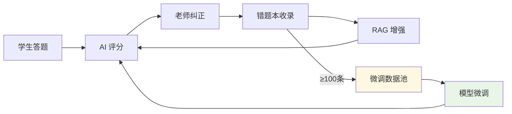

### 触发微调的条件

- `/纠正` 频率高：每周 >10 条
- 同一错误重复出现
- AI 输出格式不稳定
- Band 系统性偏差

---

## 八、技术栈

| 层级 | 技术选型 |
|------|---------|
| 对话界面 | Telegram Bot |
| 语音识别 | OpenAI Whisper |
| AI 推理 | MiniMax 大语言模型 |
| 知识库 | RAG（轻量版） |
| 数据存储 | Notion API |
| 定时任务 | cron |
| 状态管理 | Python 状态机 |

---

## 九、复盘与优化

### 做得好的

- 产品闭环完整，真正解决了教学痛点
- AI 能力设计克制，不过度设计
- 数据飞轮设计为后续进化留足空间

### 可以优化的

| 方向 | 当前状态 | 优化目标 |
|------|---------|---------|
| 学生主动提问 | 缺失 | 增加学生与 AI 助教对话入口 |
| RAG 升级 | 轻量版 | 数据量上来后升级向量检索 |
| 微调启动 | 未启动 | 错题本积累到 100 条后验证 |

---

## 十、相关链接

- GitHub 仓库：https://github.com/KaichenCurry/ielts-speaking-ai
- 题库规模：66 套真题
- Band 误差：≤0.3（实际 0.2）
- 格式正确率：≥98%
